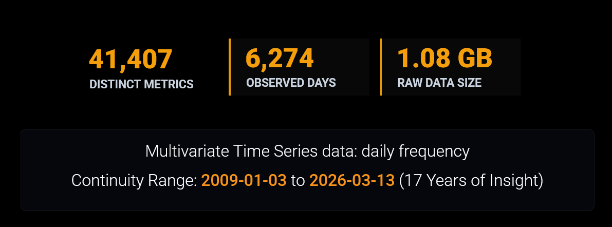

We are a team of 4 **Master of Data Science** students from the **University of British Columbia** who are passionate about Bitcoin and financial markets. 

The challenge of investing in Bitcoin is simple to describe but difficult to solve: if you have a fixed amount of money to invest over time, can you consistently buy more Bitcoin by adjusting your purchases based on market conditions, rather than investing the same amount every day?

{#fig_bitcoin fig-pos="H"}

This project, built in partnership with the [Trilemma Foundation](https://www.trilemma.foundation/), aims to evaluate whether public Bitcoin market and on-chain data can be leveraged to improve long-term accumulation compared to a naive **Dollar-Cost Averaging (DCA)** approach, which serves as our primary baseline strategy.

The goal is to improve long-term accumulation efficiency by acquiring more Bitcoin with the same fixed budget. We measure this using Sats per Dollar (SPD), which represents the amount of Bitcoin or satoshis (Sats) accumulated per dollar invested. Using the BRK (@brk) metrics dataset from the StackSats ecosystem, which contains daily market and on-chain metrics from 2009 to 2026, we analyze 41,000+ metrics, apply feature reduction, and backtest adaptive allocation strategies against naive DCA.

## The Challenge with Naive DCA

For institutions and foundations looking to build Bitcoin exposure, Dollar-Cost Averaging (DCA) - investing a fixed amount at regular intervals - is a very common and disciplined strategy. However, naive DCA has a key limitation: it does not adapt to changing market conditions. It buys the same amount whether the market is heavily overvalued during a euphoria phase or significantly undervalued during capitulation.

For investors with fixed accumulation budgets, this rigidity can lead to reduced efficiency, meaning they miss out on prime opportunities to acquire more Bitcoin for the same fiat cost.

## Our Approach: Adaptive DCA

Our objective is to develop an **adaptive daily allocation model**. Instead of fixed purchases, our strategy adjusts its allocations dynamically based on public on-chain and market signals. 

We measure our success using **Sats per Dollar (SPD)**. Our goal is to systematically maximize the amount of Bitcoin (or satoshis) we accumulate per dollar invested while adhering to strict validation checks (to prevent look-ahead bias and floating-point drift).

### Key Data & Signals

We are leveraging the open-source **BRK dataset** from the StackSats ecosystem. This rich dataset provides over 41,000 distinct daily metrics stretching back to 2009.

{#fig_data_details fig-pos="H"}

Our strategy explores key on-chain indicators known to historically signal favorable accumulation windows, such as:

- **MVRV (Market Value to Realized Value)**: Identifies when the market price dips below the aggregate cost basis.
- **NUPL (Net Unrealized Profit/Loss)**: Highlights periods when the majority of holders are underwater.
- **SOPR (Spent Output Profit Ratio)**: Indicates capitulation when coins are sold at a loss on aggregate.

### Defining Success: Metrics & Evaluation

-   **Sats per Dollar - SPD:**\
    We evaluate accumulation efficiency using Sats per Dollar (SPD), defined as the total Bitcoin accumulated per unit of USD invested. A higher SPD indicates better performance, as it reflects a lower average acquisition cost.
-   **Win Rate:**\
    Win Rate is binary, i.e., beating uniform DCA in a window is a win irrespective of the margin. Use the percentage of evaluation windows where the adaptive strategy outperforms uniform DCA in terms of SPD. A win rate above 50% indicates that the adaptive strategy is more effective than uniform DCA in the majority of cases.
-  **Exponential-Decay Percentile:**\
    This metric is a recency-weighted average of the strategy's percentile scores across all windows. Each window's percentile shows where the strategy's SPD falls between the minimum and maximum SPD for that window. Recent windows get higher weight, so the metric tells us how well the strategy performed overall, with more focus on recent performance.
-   **Score:**\
    A composite metric that combines 50% Win Rate and 50% Exponential-Decay Percentile to provide an overall performance score for the adaptive strategy. This score helps to summarize the effectiveness of the strategy in a single value, facilitating easier comparison against the baseline.

**_Continue reading our strategies and results in the below posts!_**

### Strategy Performance Comparison

| Metric | Multi-Strategy Regime-Based |HMM-GARCH Adaptive | HMM-BAYES Adaptive | Composite Signal Index | External Tunable | Uniform (Baseline)
|---|---|---|---|---|---|---|
| Win Rate | 64.57% | 72.75% | 76.29% | 100% | 100% | can't beat itself |
| Exponential-Decay Percentile | 40.36% | 47.35% | 40.63% | 60.42% | 65.5% | 38.0% |
| Score | 52.46% | 60.05% | 58.46% | 80.21% | 82.76% | 19.0% |
| Avg SPD | 1346 \newline (+4.14%) | 1313 \newline (+1.60%) | 1297 \newline (+0.37%) | 1423 \newline (+10.13%) | 1346 \newline (+4.14%) | 1292 |

: Strategy performance summary (test period, 2024–2025) {#tbl-strategy-comparison tbl-colwidths="[15,15,15,15,15,15,10]"}

---
