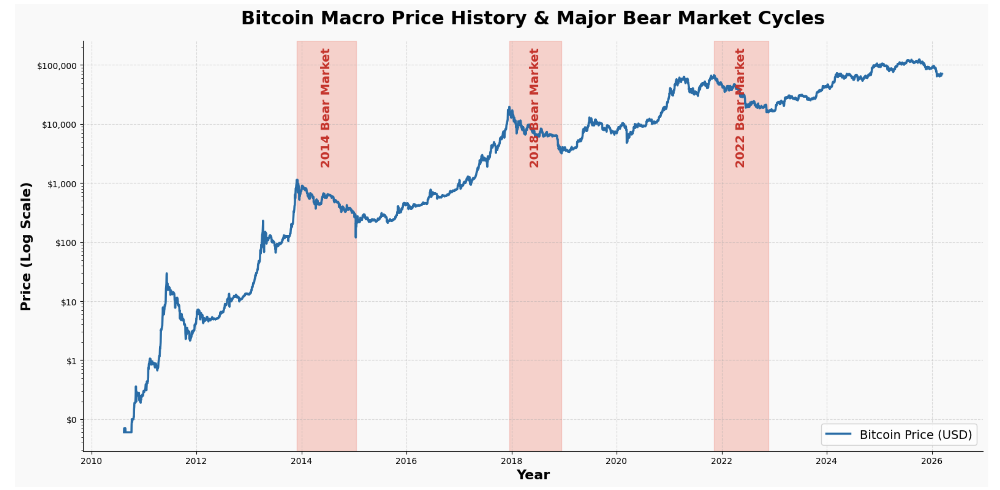

## The Core Concept: Why Macroeconomics?

Uniform Dollar Cost Averaging (DCA) is blind—it buys the same amount of Bitcoin regardless of whether the market is crashing or skyrocketing. While our base models improve upon this by using on-chain signals like MVRV to identify overvalued or undervalued conditions, they are still limited to looking strictly at Bitcoin-native data.

The **External Tunable Strategy** completely shifts this paradigm. It operates on the thesis that Bitcoin does not exist in a vacuum; it is a highly sensitive risk asset heavily influenced by global macroeconomic liquidity. 

By integrating the external macroeconomic indicators, specifically the **10-Year U.S. Treasury Yields**, this strategy detects shifting financial environments. It identifies periods when borrowing money is cheap to aggressively boost Bitcoin accumulation, while identifying periods when borrowing gets expensive to safely slow down and conserve capital

## The Original Features

#### 1. **Bitcoin Price (in USD):** 

The absolute price of the Bitcoin, sourced from the Bitcoin Value Research Kit.

#### 2. **10-Year U.S. Treasury Yields:** 

The interest rate on 10-year government debt, sourced from Yahoo Finance. Acts as the foundational benchmark for global borrowing costs and is the ultimate indicator of whether investors are feeling fearful or confident (@investopedia_treasury)

**Why the 10-Year U.S. Treasury Yields?**

1. **The Global Baseline for Borrowing Costs**: When this yield falls, borrowing money becomes cheap, which stimulates economic growth and floods the market with capital. When the yield rises, borrowing becomes expensive, choking off liquidity (@investopedia_treasury).
2. **The "Fear vs. Greed" Confidence Indicator**: U.S. Treasuries are considered one of the safest investments in the world. Therefore, when investors are terrified of a recession, they buy lots of them, which drives the yield down. When investors are confident, they sell their safe bonds to buy riskier, high-growth assets like Bitcoin, driving the yield up (@investopedia_treasury).

## The Engineered Features

From the Original Features above, we engineered the following features to capture the macroeconomic trends:

#### 1. **Treasury_90d_Delta:** 

The 90-day percentage change in the 10-Year Treasury Yield. This acts as a leading indicator of global liquidity. A rapidly dropping yield signals an influx of cheap money into the economy, while spiking yields signal inflation fears and tightening liquidity.

$\Delta T_{90} = \frac{Yield_t}{Yield_{t-90}} - 1$

Mathematically, this calculates the exact percentage change in the 10-Year Treasury Yield over a rolling 90-day window. It takes today's Yield, divides it by the Yield from exactly 90 days ago, and subtracts 1 for the raw percentage difference.

- If the result is _positive_ (e.g., 0.15), it means Treasury Yields are spiking and have jumped 15% over the last quarter, signaling tightening liquidity.
- If the result is _negative_ (e.g., -0.10), it means Yields are dropping and have fallen 10% over the last quarter, signaling an influx of cheap money.

**Why 90 days?**: 

According to @investopedia_quarter, 90-day period perfectly represents one fiscal quarter (a 3-month cycle). The entire corporate and economic world operates on this quarterly rhythm. Public companies release their earnings reports, governments do budget planning, and massive institutional investors rebalance their portfolios every three months.

By measuring the Treasury yield over a 90-day window, this strategy tracks exactly one full cycle of global economic data. It is long enough to ignore daily market noise, but short enough to immediately detect when the market is shifting its money for the next quarter.

#### 2. **MOM15 (15-Day Momentum):** 

A short-term trend indicator tracking whether Bitcoin's price is currently accelerating upwards or breaking downwards. 

$MOM15_t = \frac{Price_t}{Price{t-15}} - 1$

Mathematically, this calculates the exact percentage change in Bitcoin's price over a rolling 15-day window. It takes today's price, divides it by the price from exactly 15 days ago, and subtracts 1 for the raw percentage difference.

- If the result is _positive_ (e.g., 0.10), it means Bitcoin is currently in a short-term uptrend (e.g., short-term 10% uptrend) 
- If the result is _negative_ (e.g., -0.05), it means Bitcoin is bleeding and has lost its value over the last two weeks (e.g., lost 5% value)

**Why 15 days?**

A roughly 14 to 15 days window is the universall common choice for measuring the short-term trend of an asset. This window is based on the Relative Strength Index, a momentum oscillator that measures the speed and change of price movement (@investopedia_rsi).

#### 3. **1-Year Price Drop ($1YPR$):** 

A comparative metric calculating the percentage difference between today's Bitcoin price and the price exactly 365 days ago, used to detect catastrophic value crashes.

$1YPR_t = \frac{Price_t}{Price{t-365}} - 1$

Mathematically, this calculates the exact percentage change in Bitcoin's price over a rolling 365-day window. It takes today's price, divides it by the price from exactly 365 days ago, and subtracts 1 for the raw percentage difference.

**Why 1-year?**: 

As shown in the graph below, historical bear markets (where Bitcoin's price drops significantly) usually last for roughly 1 year. Therefore, we engineered this feature to mathematically detect these prolonged crash events, allowing the algorithm to capture the exact moments when Bitcoin is extremely undervalued.

{.center width="100%" height="100%"}

## The Baseline Foundation: Base Preference ($\rho_t$):

The foundational target weight generated by the stacksats baseline engine. The framework calculates this preference score by analyzing the **MVRV (Market-Value-to-Realized-Value) ratio**, a famous on-chain metric that compares Bitcoin's current market cap to the price at which coins last moved (@stacksats).

- When MVRV is low, the network is historically undervalued, and stacksats generates a high preference weight.
- When MVRV is high, the network is historically overvalued, and stacksats generates a low preference weight.

This Tunable Macro Strategy uses this stacksats output as the **_preference weight_** and then dynamically boosts or dampens it based on what the broader global economy is doing.

## The 4-Tier Decision Matrix

The core of the strategy is a strict, priority-based decision tree. Every day, the model takes the baseline **_preference weight_** (generated by the MVRV signal) and evaluates current macroeconomic conditions from top to bottom. Once a macro condition is met, the strategy applies a multiplier to either boost or dampen that preference weight, producing the final target "Buy Weight" ($w_t$). It then stops evaluating.

#### **Tier 1: The Value Crash (Absolute Priority)**

**Condition:** If today's Bitcoin price is $\leq 60\%$ lower than it was 1 year ago.
When Bitcoin suffers a catastrophic, multi-month crash, it represents an excellent buying opportunity regardless of what the broader macro economy is doing.

**Action:** Aggressively buy the blood. 

**Math:** $w_t = \max(2.0 \cdot \rho_t, 0.6)$

#### **Tier 2: The Macro Crash (Risk-Off)**

**Condition:** If `Treasury_90d_Delta` $\geq \alpha_{spike}$ **AND** `MOM15` $\leq \beta_{break}$.

This tier detects toxic financial environments. If Treasury yields are spiking (indicating tightening global liquidity) and Bitcoin's momentum is dying, the model recognizes a "Risk-Off" regime.

**Action:** Conserve cash. Stop aggressively buying falling knives.

**Math:** $w_t = 0.5$

#### **Tier 3: The Golden Environment (Risk-On)**

**Condition:** If `Treasury_90d_Delta` $\leq 0.0$ **AND** `MOM15` $\geq 0.0$.

If interest rates are falling, making borrowing cheap and pushing capital out of safe-haven bonds into risk assets, and Bitcoin's momentum is already confirming the upward trend.

**Action:** Heavily boost the standard MVRV buy signal to capture the incoming liquidity wave.

**Math:** $w_t = \max(\gamma_{boost} \cdot \rho_t, 0.4)$

#### **Tier 4: Normal Market (Default)**

**Condition:** If none of the extreme regimes above are met, then the market is consider to be in a normal, sideways, or ambiguous state.

**Action:** Dampen the base signal to save cash for future volatile opportunities.

**Math:** $w_t = \max(\delta_{dampen} \cdot \rho_t, 0.5)$

## Hyperparameter Tuning
Rather than hardcoding the thresholds for these economic regimes, the strategy exposes four critical variables to be optimized via a Grid Search algorithm against historical data:

1. **`macro_spike` ($\alpha$):** The exact percentage increase in Treasury yields required to trigger a "Macro Crash" alarm.
2. **`mom_break` ($\beta$):** The exact negative momentum threshold required to confirm that a "Macro Crash" is actually dragging Bitcoin's price down.
3. **`boost` ($\gamma$):** The multiplier applied to the buy signal during a "Golden" Risk-On environment (e.g., $1.5x$ or $2.0x$).
4. **`dampen` ($\delta$):** The multiplier used to suppress buying during normal, sideways markets (e.g., $0.6x$ or $0.8x$).

By evaluating hundreds of combinations of these parameters across thousands of 365-day rolling windows, we optimized the model to maximize both the absolute **Win Rate**, the **Exponential-Decay Percentile**, and the **Average Sats Per Dollar**, proving how adapting to macroeconomic feature can help improve the algorithm overall performance.

## Final backtest visualization

{fig-align="center" width="100%"}

## Key results

* Optimal parameters: **`macro_spike`**: 0.2, **`mom_break`**: 0.05, **`boost`**: 1.2, **`dampen`**: 0.5

For the **training period (2018–2023)**, the multi-strategy approach achieved an SPD of **8,210.91**, compared with **8,418.79** for Uniform DCA, which corresponds a **2.47%** down.

For the **test period (2024–2025)**, the multi-strategy approach achieved an SPD of **1,346.27**, compared with **1,292.12** for Uniform DCA, corresponding to an improvement of **4.19%**.

In the final StackSats comparison, the External Tunable approach also achieved a **win rate of 62.43%**, a **score of 63.97%**, and an **exponential-decay percentile of 65.52%**. These results suggest that the strategy satisfy all of the requirement that ensure the model pass, and also perform better on the test period than Uniform DCA.

## Limitations

**1. Blind to big Bitcoin's Holder Dump:**

Because it relies heavily on traditional U.S. Treasury data, the model easily detects slow global economic shifts but is completely blind to sudden, unpredictable crypto-specific events. For example, one of the major causes of Bitcoin crashes is when massive institutional holders (e.g., MicroStrategy) unexpectedly sell large amounts of Bitcoin. The market can crash violently within hours, but the macro-indicators would be completely unaware of this localized sell-off, incorrectly signaling a "safe" environment while the price plummets.

**2. Not a dynamic, daily-learning model:**

For this algorithm to be applied as a true dynamic model (where it automatically re-tunes its own parameters every day based on live data), significant computational resources would be required. Furthermore, because we optimized the threshold parameters strictly on the 2018–2023 training period, there is no guarantee that the model will perform equally well in future, unprecedented macroeconomic environments.