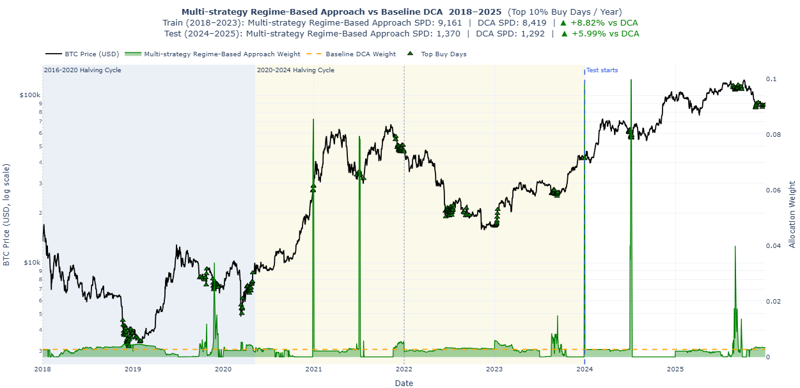

## Why this strategy was needed

A simple dollar-cost averaging strategy invests the same amount of money at regular intervals, regardless of market conditions. This is easy to understand and is often a strong baseline for long-term Bitcoin accumulation. However, Bitcoin does not move in a straight line. It goes through very different market environments, including strong bull markets, deep bear markets, recovery periods, and sideways periods.

Because of this, one fixed strategy may not always be the best choice. A momentum-based strategy might work well during strong upward trends, but it may struggle when the market is choppy. A valuation-based strategy might work better when Bitcoin appears undervalued, but it may be less effective during strong momentum-driven markets. A moving-average strategy may help identify periods where price is below a longer-term trend level, but it may not work equally well in every market phase.

The idea behind the multi-strategy regime-based approach was to avoid forcing one signal to work in all market conditions.

Instead, this approach asks a more flexible question:

**Can we identify the current market regime and use the strategy that historically worked best in that type of regime?**

The goal is not to predict the exact future price of Bitcoin. The goal is to improve Bitcoin accumulation compared with Uniform DCA by changing the allocation pattern based on the market environment.

## High-level idea

The strategy has two main parts:

1. **Classify each day into a market regime.**
2. **Choose the best allocation strategy for each regime using training data.**

A regime is a label that describes the type of Bitcoin market environment on a given day. In this strategy, each regime is created by combining three parts:

* **Bitcoin trend**: whether the market looks like a bull, bear, recovery, or neutral period
* **MVRV valuation**: whether Bitcoin looks relatively cheap, normal, or expensive based on MVRV
* **Growth relationship**: whether market-cap growth or realized-cap growth is leading

So each day receives a combined regime label in this format:

> **Bitcoin trend | MVRV valuation | Growth relationship**

For example, one day might be classified as:

> **BTC Bull | Normal MVRV | Market Growth Leading**

Another day might be classified as:

> **BTC Bear | Low MVRV | Realized Growth Leading**

These examples may look detailed at first, but each part of the regime is explained in the sections below. The key idea is that the model first identifies the market environment, then uses training data to learn which candidate allocation strategy worked best in that type of environment.

Once the best strategy is learned for each regime, the same regime-to-strategy mapping is applied to the test period. This makes the strategy more adaptive than a single fixed rule, while still keeping the logic easy to explain.

## Key features used

The strategy used a focused set of raw Bitcoin market and on-chain features, then created engineered rolling features from them. Feature selection was guided by the goal of capturing different Bitcoin market conditions, rather than using a large number of unrelated indicators.

We also created features based on simple moving averages in this approach. A simple moving average (SMA) is the average price of an asset over a fixed number of past days. In this strategy, SMA-based features were engineered from the Bitcoin price series and used to compare Bitcoin's current price with its recent trend.

The main raw input features were:

* **price_usd**: This represents the daily Bitcoin price in USD. It was the core market feature because the strategy's allocation decisions depend on whether Bitcoin is relatively strong, weak, expensive, or cheap compared with recent price history. The price series was also used to create engineered trend features such as moving averages, price-to-simple-moving-average ratios (SMA), and lookback returns.

* **mvrv**: MVRV stands for Market Value to Realized Value. It compares Bitcoin’s current market value with its realized value, which is based on the price at which coins last moved on-chain. It was used as a valuation signal. A lower MVRV can suggest that Bitcoin is relatively undervalued, while a higher MVRV can suggest that Bitcoin is relatively expensive.

* **realized_cap_growth_rate**: This measures how quickly realized capitalization is changing. Realized cap is connected to on-chain investor behavior because it reflects the value of coins based on when they last moved. This helped capture whether on-chain value was growing, which can indicate stronger underlying accumulation or network-level value movement.

* **market_cap_growth_rate**: This measures how quickly Bitcoin’s market capitalization is changing. Since market cap is closely tied to price, this feature captures price-driven growth. Comparing market-cap growth with realized-cap growth helped distinguish whether the market was being led more by price momentum or by on-chain realized value growth.

Together, these raw features allowed the strategy to capture three important dimensions of Bitcoin market behavior: price trend, valuation, and the relationship between market-driven growth and on-chain value growth.

The strategy also created engineered features from the Bitcoin price series. For each selected lookback window `d`, three rolling features were created:

* **price_{d}d_sma**: the simple moving average of Bitcoin price over `d` days
* **price_{d}d_sma_ratio**: the ratio of current Bitcoin price to its `d`-day moving average
* **btc_return_{d}d**: Bitcoin return over the past `d` days

For example, a 90-day lookback would create features such as `price_90d_sma`, `price_90d_sma_ratio`, and `btc_return_90d`.

These engineered features were important because raw price alone does not fully describe the market condition. A Bitcoin price of $60,000 can mean different things depending on whether price is above or below its moving average, whether recent returns are positive or negative, and whether valuation is high or low. The SMA ratios and lookback returns helped convert raw price data into trend and momentum signals for regime classification.

These features were then used to classify each day into one of the combined market regimes. The trend regime used SMA ratios and recent returns. MVRV was used to classify valuation as low, normal, or high. Realized-cap growth and market-cap growth were compared to classify whether realized growth or market growth was leading.

## Selecting the final settings

The strategy depends on several tuning settings. These settings are not regimes themselves. Instead, they control how the features and regime labels are created.

The main tuning settings were:

* **Momentum lookback**
* **SMA lookback**
* **Regime lookback**
* **Fallback strategy**

The grid search tested different values for each of these settings.

**Momentum lookback grid**

```text
[21, 30, 45, 60, 75, 90, 120, 150, 180]
```

**SMA lookback grid**

```text
[60, 90, 120, 150, 180, 200, 210, 240, 270, 300, 340]
```

**Regime lookback grid**

```text
[60, 90, 120, 150, 180, 200, 210, 240, 270, 300, 340]
```

**Fallback strategy grid**

```text
["sma", "stacksats_mvrv_weight", "stacksats_momentum_weight"]
```

The full grid search tested the product of all possible momentum lookbacks, SMA lookbacks, regime lookbacks, and fallback choices. Each possible combination was evaluated using training data only. The best combination was selected based on training-period improvement, training win rate, and then lower total lookback as a tie-breaker. After the final combination was fixed, the strategy was evaluated on the 2024–2025 test period.

A simple way to understand this is:

**Lookback grid = recipe settings**

**Regimes = market labels created by the chosen recipe**

For example, one grid combination might use a 30-day momentum lookback, a 90-day SMA lookback, a 180-day regime lookback, and SMA as the fallback strategy. That combination would create features and classify each day into regimes. Another combination might use different lookbacks and produce slightly different regime labels.

## The three components of the regime

The final regime classification combines three types of information:

1. **Bitcoin trend**
2. **MVRV valuation**
3. **Market-cap growth versus realized-cap growth**

Each component captures a different part of the market environment.

### 1. Bitcoin trend regime

The first part of the regime looks at the Bitcoin price trend. This helps separate the market into broad price-cycle conditions.

The strategy uses moving-average ratios and past returns to classify Bitcoin into one of four trend states:

* **BTC Bull**
* **BTC Bear**
* **BTC Recovery**
* **BTC Neutral**

A **BTC Bull** regime means Bitcoin is trading strongly above its longer-term trend and returns are positive. This usually represents a strong upward market.

A **BTC Bear** regime means Bitcoin is trading below its trend and returns are negative. This usually represents a weak or declining market.

A **BTC Recovery** regime means Bitcoin may still be below a key moving average, but short-term momentum has started to improve. This can happen after large drawdowns when the market begins to recover.

A **BTC Neutral** regime captures days that do not clearly fall into bull, bear, or recovery conditions.

This trend component is useful because different accumulation strategies may behave differently across price-cycle phases. For example, momentum strategies may work well in bull markets, while valuation-based strategies may work better in weaker or cheaper markets.

### 2. MVRV valuation regime

The second part of the regime uses **MVRV**, which stands for Market Value to Realized Value.

In simple terms, MVRV compares Bitcoin’s current market value with its realized value. Realized value is based on the price at which coins last moved on-chain. Because of this, MVRV is often used as an on-chain valuation indicator.

The strategy divides MVRV into three states:

* **Low MVRV**
* **Normal MVRV**
* **High MVRV**

A **Low MVRV** regime suggests Bitcoin may be relatively cheap compared with its on-chain cost basis.

A **High MVRV** regime suggests Bitcoin may be relatively expensive.

A **Normal MVRV** regime represents the middle range.

This is important because the strategy is focused on accumulation. If Bitcoin is relatively undervalued, buying more may help improve the number of sats accumulated per dollar. At the same time, buying aggressively when Bitcoin is overheated may not be ideal.

### 3. Growth regime

The third part of the regime compares two growth measures:

* **Market-cap growth**
* **Realized-cap growth**

Market cap reflects the current market price multiplied by supply. It moves strongly with price.

Realized cap is more connected to on-chain behavior and the value of coins based on when they last moved.

The strategy classifies the growth relationship into two states:

* **Market Growth Leading**
* **Realized Growth Leading**

If market-cap growth is stronger, the market price is leading. If realized-cap growth is stronger, on-chain realized value is leading.

This adds another layer of context. It helps the strategy distinguish between price-driven moves and on-chain value changes.

## Total number of regimes

The final regime is created by combining the three components:

* 4 Bitcoin trend states
* 3 MVRV valuation states
* 2 growth states

So the total number of possible regimes is:

**4 × 3 × 2 = 24 possible regimes**

These regimes are not manually chosen one by one. They are produced by combining the three labels.

For example:

* BTC Bull | High MVRV | Market Growth Leading
* BTC Bear | Low MVRV | Realized Growth Leading
* BTC Recovery | Normal MVRV | Market Growth Leading
* BTC Neutral | Normal MVRV | Realized Growth Leading

Each regime represents a different market environment.

## Candidate strategies

After classifying regimes, the next question is: what should the strategy do in each regime?

To answer this, the approach compares multiple candidate allocation strategies.

The candidate strategies used were:

1. **StackSats Momentum Strategy**
2. **StackSats MVRV Strategy**
3. **Custom SMA Strategy**

Each candidate strategy produces daily allocation weights. A higher weight means the strategy allocates more of the yearly budget to that day. A lower weight means it allocates less.

### StackSats Momentum Strategy

The StackSats Momentum strategy is a price-based strategy that looks at Bitcoin’s recent price movement. In this project, it uses a contrarian interpretation of momentum. This means that if Bitcoin has recently gone up, the strategy reduces the accumulation signal. If Bitcoin has recently gone down, the strategy increases the accumulation signal.

This makes sense for an accumulation strategy because the goal is not necessarily to chase price increases, but to buy more Bitcoin when short-term weakness may create a better buying opportunity. To avoid reacting too strongly to extreme price moves, the momentum signal is bounded before it is converted into allocation weights.

This strategy was included because it captures recent price behavior, which provides a different type of signal from valuation-based or moving-average-based strategies. For implementation details, see @stacksats_momentum_strategy.

### StackSats MVRV Strategy

The StackSats MVRV strategy is mainly a valuation-based strategy. MVRV stands for Market Value to Realized Value. It compares Bitcoin's current market value with its realized value, which is based on the price at which coins last moved on-chain.

The basic idea is that when Bitcoin looks undervalued based on MVRV, the strategy gives a higher accumulation preference. When Bitcoin looks expensive or overheated, the strategy gives a lower accumulation preference.

This is useful for a Bitcoin accumulation strategy because the goal is to buy more sats per dollar. If Bitcoin is cheaper relative to its realized value, allocating more on those days may improve long-term accumulation compared with investing the same amount every day. For implementation details, see @stacksats_mvrv_strategy.

### Custom SMA Strategy

The custom SMA strategy uses the relationship between Bitcoin’s price and a simple moving average.

The basic idea is:

* If Bitcoin is below its moving average, the strategy may allocate more.
* If Bitcoin is above its moving average, the strategy may allocate less.

This creates a simple mean-reversion-style accumulation rule. It tries to buy more when price is relatively weak compared with its recent trend.

This strategy is easy to interpret and provides a useful contrast to MVRV and momentum.

## Learning the best strategy per regime

Once the candidate strategies are created, the strategy compares them within each regime using the training period.

The training period is 2018 to 2023. This period contains multiple Bitcoin market environments, including bull markets, bear markets, and recovery periods.

For each regime, the strategy checks which candidate performed best during training. The best-performing candidate becomes the selected strategy for that regime.

For example:

| Regime                                             | Best strategy learned from training |
| -------------------------------------------------- | ----------------------------------- |
| BTC Bull \| Normal MVRV \| Market Growth Leading     | Momentum                            |
| BTC Bear \| Low MVRV \| Realized Growth Leading      | MVRV                                |
| BTC Recovery \| Normal MVRV \| Market Growth Leading | SMA                                 |

This table is only an example. The actual learned mapping depends on the data.

The key idea is that the strategy does not use the same allocation rule everywhere. It learns a regime-to-strategy mapping from historical training data.

## Fallback strategy

One issue with regime-based methods is that not every possible regime may appear in the training period. The strategy can create up to 24 possible regimes, but some of them may be rare or absent in the 2018–2023 training data.

This creates a practical problem during testing. If a new regime appears in the 2024–2025 test period and the model has not learned a best strategy for it, the model still needs a rule for how much to allocate.

To handle this, the strategy used a fallback strategy. The fallback strategy is the default allocation rule used when the current regime does not have a learned regime-to-strategy mapping.

The fallback options tested were:

* **SMA fallback**
* **MVRV fallback**
* **Momentum fallback**

The fallback choice was selected using training performance only. This avoided using the test period to decide which fallback worked best. In the final strategy, the fallback rule helped make the model more robust because it could still produce an allocation even when an unseen or rare regime appeared.

## Model selection and final testing

A key part of the design was keeping model selection separate from final testing. The grid search was performed using training data only. This means the strategy selected its lookbacks and fallback strategy based on 2018–2023 performance.

Only after the final configuration was selected was the model evaluated on the 2024–2025 test period.

This matters because if test performance is used during tuning, the reported test result becomes less reliable. The strategy might look good only because it was indirectly optimized for the test period.

The final workflow was:

1. Use training data to learn regime mappings.
2. Use training data to select lookbacks and fallback strategy.
3. Freeze the final configuration.
4. Evaluate on the test period once.

## Evaluation metrics

This strategy was evaluated using the same metrics defined on the [main blog page](../../index.qmd#evaluation-metrics): sats per dollar, percentage improvement versus Uniform DCA, win rate, score, and exponential-decay percentile.

## Full-period strategy visualization

{fig-align="center" width="100%"}

## Key results

The multi-strategy regime-based approach outperformed Uniform DCA in both the training and test periods.

For the **training period (2018–2023)**, the strategy achieved an SPD of **9,161.44**, compared with **8,418.79** for Uniform DCA. This corresponds to an improvement of **8.82%**.

For the **test period (2024–2025)**, the strategy achieved an SPD of **1,369.57**, compared with **1,292.12** for Uniform DCA. This corresponds to an improvement of **5.99%**.

In the final StackSats comparison, the strategy achieved a **win rate of 63.76%**, a **score of 51.24**, and an **exponential-decay percentile of 38.72**.

Overall, these results suggest that the multi-strategy regime-based approach accumulated more sats per dollar than Uniform DCA, while also remaining competitive under the broader StackSats evaluation framework.

## Why this approach is useful

The main strength of this strategy is adaptability.

Instead of saying “MVRV is always best” or “momentum is always best,” the strategy allows different signals to be useful in different environments.

This makes sense because Bitcoin’s behavior changes across cycles. A valuation signal may be more useful after large drawdowns. A momentum signal may be more useful during strong upward markets. A moving-average signal may be more useful during recovery or mean-reversion periods.

The approach is also interpretable. Each regime has a readable label, and each regime maps to a specific candidate strategy. This makes it easier to explain than a black-box model.

For example, we can explain that the strategy selected MVRV in a low-valuation regime because that candidate historically accumulated more sats under similar conditions.

## Limitations

- The regimes are rule-based. The model depends on thresholds such as MVRV cutoffs and moving-average conditions. These thresholds may not perfectly capture future market behavior.

- Bitcoin cycles are limited in number. Even though the training period includes several market environments, it still represents a small number of full Bitcoin cycles. This makes it difficult to know whether the learned regime mapping will generalize to future cycles.

- Some regimes may appear rarely. If a regime has only a small number of days, the learned best strategy for that regime may not be reliable. To reduce this issue, the model requires a minimum number of days before evaluating a regime.

## Final interpretation

The multi-strategy regime-based approach is an interpretable adaptive allocation strategy. It classifies Bitcoin market conditions into regimes and learns which candidate strategy worked best in each regime during training.

Its main contribution is that it combines multiple signals instead of relying on a single fixed strategy. It uses MVRV, momentum, and SMA-based behavior in a structured way, allowing the allocation rule to change depending on the market environment.

The strategy is useful because it helps answer a practical question:

***Are different Bitcoin accumulation signals useful in different market regimes?***

The results suggest that different signals can be useful in different market conditions. Instead of treating one signal as always best, this approach allows the strategy to adapt based on the current regime.

These results should be interpreted carefully. The strategy is not a guarantee of future performance, and Bitcoin market behavior may change. However, it provides a strong foundation for future work, such as adding more robust regime definitions, testing more candidate strategies, and evaluating the method over future market cycles.
