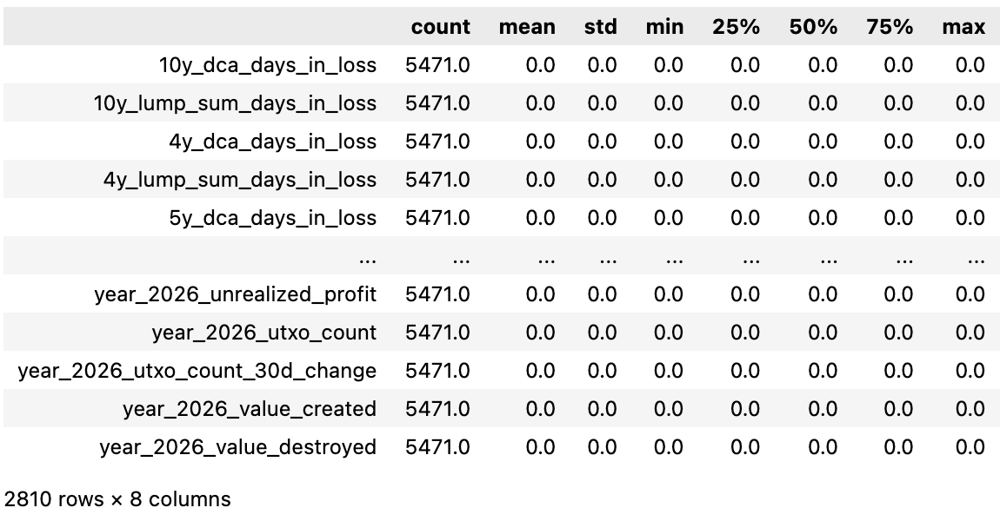

# Introduction
Large banks and hedge funds use sophisticated algorithms, privileged market access, and sometimes non-public information to trade. Smaller institutions and retail investors cannot compete on those terms. This project asks: can publicly available Bitcoin (@nakamoto2008) on-chain data be used to build a smarter accumulation strategy - one that beats simple Dollar-Cost Averaging (DCA) without requiring any special access or resources?

_Why Bitcoin?_

We focus on Bitcoin because it's well-suited for this kind of research. All transaction data is public and available to everyone simultaneously - no information asymmetry. Strategies can be audited in real-time on-chain, and the market has operated long enough (since 2009) to provide meaningful historical data across multiple market cycles.

The simplest accumulation strategy is DCA - invest a fixed amount at regular intervals regardless of price. It works, but it ignores market conditions entirely. Our hypothesis is that on-chain signals can identify when Bitcoin is undervalued, allowing smarter allocation decisions (@leggio2001).

### Objectives
- Identify on-chain/market signals predicting favorable accumulation windows
- Build and validate an adaptive daily allocation model
- Deliver as open-source Python library

# Data & EDA
- **Source:** BRK `brk_metrics.parquet` (@brk via @stacksats) 
- **Schema:** long format - day_utc, metric, value; zero nulls; all values finite

|Property|Value|
|--------|-----|
|File size|~1.08 GiB|
|Total rows|236,259,020|
|Daily observations|6,274 days|
|Distinct metric keys|41,407|
|Date range|2009-01-03 to 2026-03-13|

The 41,407 metrics span several categories including price, market valuation, holder behaviour, network activity, and technical indicators. The figures below show how metric coverage has grown over time, Bitcoin's price history across halving epochs, and how key signals are correlated.

### Zero Variance Features Selection

One of the first strategies we used in the feature selection step was removing columns with zero variance. According to @kuhn2019feature, features with a single unique value (zero variance) provide no information gain. Therefore, removing them helps avoid numerical instability.

After applying this approach, 2,810 features were removed from the training dataset.

  

### Table
  
  

  

  

- **Limitations:** The dataset requires lazy loading due to its size. Many metrics only begin after 2009, and there is heavy multicollinearity across the 41k features.

# Data Science Approach
### Feature Reduction

With over 41,000 features, we aim to identify which features capture similar information to make the dataset more manageable for modeling. To achieve this, we follow a structured feature reduction approach.

First, we group features based on their names using rule based parsing, which helps create feature families such as price-related features. Next, within each family, we apply hierarchical clustering to group features that behave similarly over time, using dendrograms for visualization. Then, from each cluster, we retain a small set of important features and remove those that are highly similar, reducing the dataset size while preserving key information. 

This process is computationally intensive when run locally with limited resources, so we may explore more efficient feature reduction methods in future iterations.

### Baseline Strategies (fixed this since their model is dynamic)

To evaluate our approach, we aim to implement a **Dynamic Dollar-Cost Averaging (DCA)** strategy as the baseline, where a fixed amount is invested at regular intervals regardless of market conditions. This provides a simple benchmark, and our goal is to outperform it by improving accumulation efficiency.

To improve upon this baseline, we are exploring more effective accumulation strategies. In particular, we plan to implement **Value Averaging** as our primary strategy, which adjusts investment based on a target portfolio growth path, allocating more capital during price declines and less during price increases. This aligns well with our objective of maximizing **Sats per Dollar (SPD)**.

In addition, we may also evaluate a **200-day SMA-based strategy**, which adjusts investment based on long-term market trends, providing a simple signal-based benchmark.

### Model Development

Our proposed strategy will leverage the reduced feature set to design a data-driven accumulation approach.

The objective is to:

- Identify periods of undervaluation
- Dynamically adjust investment allocation
- Improve accumulation efficiency compared to the defined baseline strategies

### Train/Test Split

To avoid look-ahead bias and reflect a realistic backtesting setup, we use a chronological train/test split.

- **Training set:** Data up to December 2023
- **Test set:** January 2024 to March 2026

The test set will remain untouched during model development and will only be used for final evaluation.

### Future Work

In future iterations, we may explore additional models and strategies such as LSTM-based models and Hidden Markov Models (HMM). These approaches will be evaluated against the baseline strategies to assess potential improvements in accumulation efficiency.

# Evaluation & Success Criteria

### Backtesting

The key metric used in backtesting was Sats-per-dollar (SPD). The backtesting process included two frameworks: Validation Checks and Performance Results @stacksats:

**Validation Checks** included integrity checks designed to reduce leakage risk and arithmetic drift. These were evaluated through:

1. Weight Sum Validation: Confirms that each window’s daily allocations sum to exactly 100% of the budget within floating-point tolerance, ensuring a fair comparison against the uniform DCA baseline.
2. Forward-Leakage Test: Future data is masked and the model weights are recomputed to ensure the results remain consistent.
3. Win-rate Requirement: The model must outperform plain/uniform DCA in more than 50% of the evaluation windows.

**Performance Results** summarized the key SPD and percentile results:

1. Percentile Statistics: Measures the minimum, maximum, mean, median, and exponentially weighted percentile (where recent windows receive greater weight) of the winning rate against naive DCA.
2. Strategy Validation: Evaluates whether the model outperforms DCA based on the win-rate threshold (greater than 50%), using 2558 rolling one-year windows from 2018 to the present.

The model is then scored by combining the win rate and exponentially weighted percentile into a single benchmark.

### Metrics

- **Primary Metric (Sats per Dollar - SPD):**  
  We evaluate accumulation efficiency using Sats per Dollar (SPD), defined as the total Bitcoin accumulated per unit of USD invested. A higher SPD indicates better performance, as it reflects a lower average acquisition cost.

- **Smoothness (Allocation Stability):**  
  We measure the standard deviation of daily allocation weights. Lower variability indicates a more stable investment schedule with potentially lower market impact.

### Success Criteria

A strategy is successful if it achieves higher SPD than the dynamic DCA baseline in more than 50% of tested rolling windows, is statistically significant (p < 0.05), holds across at least one bull and one bear cycle, passes all strict validation checks mentioned above, and has no look-ahead bias. 

### Stakeholders

- **Trilemma Foundation:** Interested in improving long-term Bitcoin accumulation efficiency  
- **Open-source community:** Focused on transparency, reproducibility, and practical usability of the strategy  

# Timeline

| Milestone | Target Date |
|-----------|-------------|
| Train/test split + EDA scripts |May 15, 2026|
| Feature reduction + baseline DCA |May 22, 2026|
| ML model + walk-forward CV | May 29, 2026|
| Backtesting + final evaluation | June 12, 2026|
| Final report + model | June 23, 2026|

## References