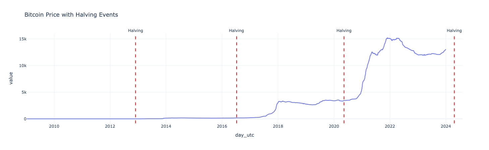
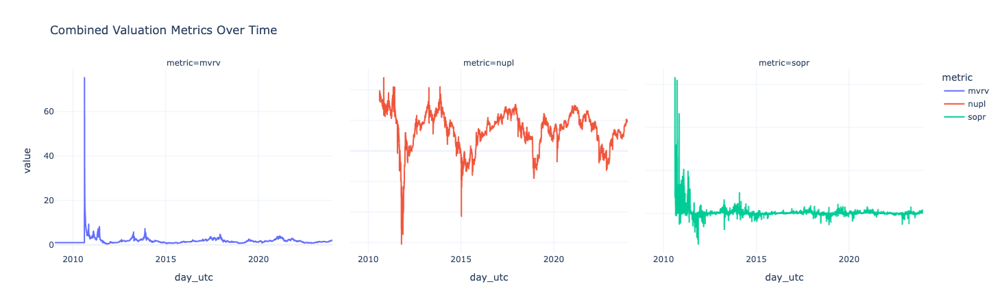

# Introduction
The purpose of this proposal is to outline a strategy for enhancing institutional Bitcoin (@nakamoto2008) accumulation. As the demand for Bitcoin continues to grow, it is crucial for institutions to adopt effective methods for acquiring and managing their Bitcoin holdings. This proposal will discuss various approaches and best practices that institutions can implement to optimize their Bitcoin accumulation process.

### Problem Statement
Modern markets are dominated by large banks and hedge funds who use sophisticated algorithmic trading strategies as well as market access, and sometimes even non-public information, making it extremely difficult for regular institutions or individuals to compete. Some financial Institutions, particularly smaller sized firms, and retail investors, face a critical wealth accumulation dilemma. Most of them lack the sophisticated resources required to outpace the large banks or gain an edge in the market.

- Bitcoin accumulation represents a social good imperative. It provides a level playing field where information is easily available and is not being controlled by a board of directors, allowing anyone to build strategies for accumulation without offering any undue advantages.
- Bitcoin’s public architecture offers transparency and relatively easy access ensuring that critical financial data is available to everyone in the market from the smallest nonprofit to the largest bank simultaneously.
- By leveraging blockchain technology, accumulation can be audited in real-time, eliminating trust barriers. 

Dollar-Cost Averaging (DCA) is a common strategy for accumulating Bitcoin, where a fixed amount of money is invested at regular intervals regardless of the asset's price. While DCA is simple and effective for long-term accumulation, it does not take into account market conditions or on-chain signals that could indicate more favorable buying opportunities(@leggio2001).

### Objectives
- Identify on-chain/market signals predicting favorable accumulation windows
- Build and validate an adaptive daily allocation model
- Deliver as open-source Python library

# Data & EDA
- **Source:** BRK `brk_metrics.parquet` (@brk via @stacksats) 
- **Schema:** long format - day_utc, metric, value; zero nulls; all values finite

|Property|Value|
|--------|-----|
|File size|~1.08 GiB|
|Total rows|236,259,020|
|Daily observations|6,274 days|
|Distinct metric keys|41,407|
|Date range|2009-01-03 to 2026-03-13|

- **Key metric categories to use:** market & valuation (price_usd, mvrv, realized_cap), profitability/SOPR (adjusted_sopr, nupl, pain_index), holder cohorts (sth_*, lth_*), supply/scarcity, network activity, technical indicators (rsi_14d, macd_*)

Figure Placeholder : Non null metric category over time

{#halving fig-alt="Alt text" width="50%"}

Figure Placeholder : Metric coverage heatmap by category

Figure Placeholder : Correlation dendrogram of candidate signal features

{#mvrv fig-alt="Alt text" width="50%"}

- **Limitations:** requires lazy loading; some metrics start after 2009; extreme multicollinearity across 41k metrics; historical data only.

# Data Science Approach
- **Feature reduction:**
    - Dendrogram clustering + VIF thresholding for multicollinearity
- **Baseline:** naive equal-weight DCA → benchmark to beat  
- **Train/test split:** chronological 80/20 — train 
upto Dec 2023; test Jan 2024 - Mar 2026; test set untouched until final evaluation

# Evaluation & Success Criteria
- **Primary:** average USD/BTC acquisition price vs naive DCA over test period — lower is better; expressed as BTC per $1 for clarity
- **Smoothness:** std. dev. of daily allocation weights (low = stable schedule, lower market impact)
- **Success threshold:** meaningful reduction in acquisition cost AND schedule volatility vs DCA over the 2024 - 2026 test window
- **Stakeholders:** Trilemma Foundation + open-source community (reproducibility)

# Timeline

| Milestone | Target Date |
|-----------|-------------|
| Train/test split + EDA scripts ||
| Feature reduction + baseline DCA ||
| ML model + walk-forward CV ||
| Backtesting + final evaluation ||
| Final report + library packaging ||

## References