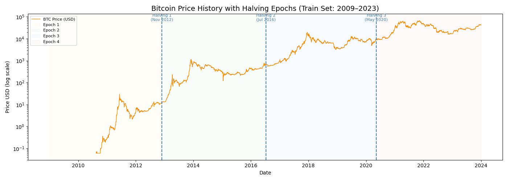
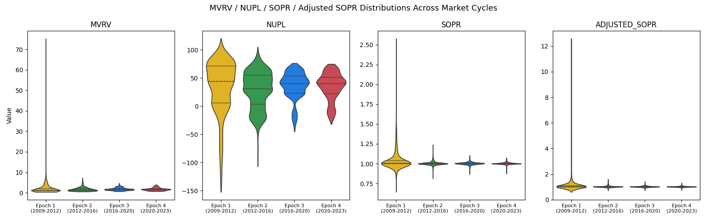
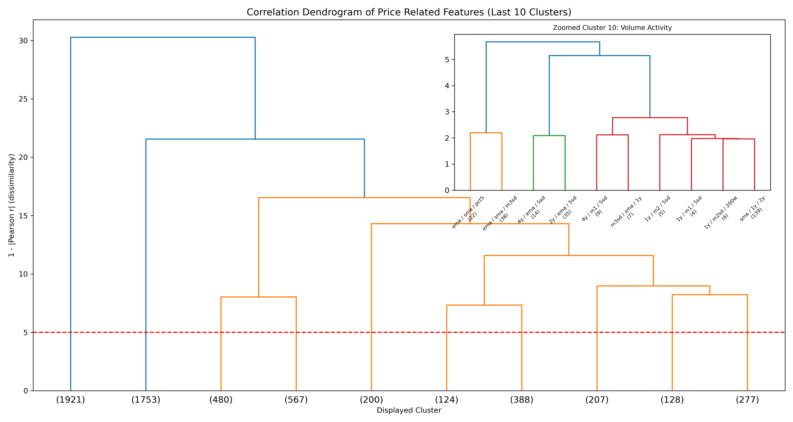

# Executive Summary

This project evaluates whether public Bitcoin (@nakamoto2008) market and on-chain data can improve long-term Bitcoin accumulation compared with naive Dollar-Cost Averaging (DCA), which serves as our primary baseline strategy. Unlike naive DCA, which invests a fixed amount regularly, our adaptive DCA strategy adjusts allocations using public signals based on changing Bitcoin market conditions. The goal is to improve long-term accumulation efficiency by acquiring more Bitcoin with the same fixed budget. We measure this using Sats per Dollar (SPD), which represents how much Bitcoin is accumulated for each dollar invested. Using the Bitcoin Research Kit (BRK) metrics dataset from the StackSats ecosystem, which contains daily market and on-chain metrics from 2009 to 2026, we analyze 41,000+ metrics, apply dimensionality reduction, and backtest adaptive allocation strategies against naive DCA.

# Introduction

Long-term Bitcoin accumulation is important for institutions and foundations building Bitcoin exposure. One common approach is Dollar-Cost Averaging (DCA), where a fixed amount is invested regularly. We use naive DCA as the baseline, but it has limitations because it does not adjust to changing market conditions. For institutions with fixed budgets, this may reduce efficiency by missing favorable buying periods.

This problem is important because smaller institutions often lack the market access and information advantages of larger financial institutions. Bitcoin provides a transparent setting because its market and on-chain data are public and auditable, enabling data-driven accumulation strategies.

We evaluate whether public Bitcoin market and on-chain data can support an adaptive DCA strategy that improves Sats per Dollar (SPD) compared with naive DCA, while using the same fixed accumulation budget. After initial analysis, we develop and backtest adaptive allocation strategies against naive DCA. The final product will include a cleaned data pipeline, strategy and backtesting logic, and evaluation results comparing adaptive accumulation against naive DCA for the Trilemma Foundation and the open-source community.

### Objectives
- Identify on-chain/market signals predicting favorable accumulation windows
- Build and validate an adaptive daily allocation model

# Data & EDA

|Property|Value|
|--------|-----|
|File size|~1.08 GiB|
|Total rows|236,259,020|
|Daily observations|6,274 days|
|Distinct metric keys|41,407|
|Date range|2009-01-03 to 2026-03-13|

: Dataset overview {#tbl-dataset-overview tbl-colwidths="[50,30]"}

The 41,407 metrics span several categories including price, market valuation, holder behaviour, network activity, and technical indicators. 

### Identifying Feature Families
  
  {#fig-feature-families fig-pos="H"}

### Zero Variance Features Selection

One of the first strategies we used in the feature selection step was removing columns with zero variance. According to @kuhn2019feature, features with a single unique value (zero variance) provide no information gain. Therefore, removing them helps avoid numerical instability.

After applying this approach, 2,810 features were removed from the training dataset.

### Halving Events and Price History

@tbl-halving-events lists each halving date and the resulting block reward reduction. Because Bitcoin has a hard cap of 21 million coins, the halving reinforces its programmed scarcity. @fig-price-history shows how Bitcoin's price (market cap / circulating supply) has evolved across those epochs, illustrating events are generally followed by significant upward price trends. (@Subawaetal2025)

|Event|Date	|Block reward|
|---|---|---|
|1st halving|28 November 2012|25 BTC|
|2nd halving|9 July 2016|12.5 BTC|
|3rd halving|11 May 2020|6.25 BTC|
|4th halving|20 April 2024|3.125 BTC|

: Bitcoin halving events and block rewards {#tbl-halving-events tbl-colwidths="[30,30,30]"}

  {#fig-price-history fig-pos="H"}

MVRV, NUPL, and SOPR are key on-chain metrics that have historically signaled favorable accumulation opportunities when they indicate undervaluation (e.g., MVRV < 1, NUPL < 0, SOPR < 1); see @sec-appendix-metrics for full metric definitions. @fig-violin-plots shows how these metrics have varied across different market cycles, with lower values often coinciding with cycle bottoms and prime accumulation zones.

  {#fig-violin-plots fig-pos="H"}
 
- **Limitations:** The dataset requires lazy loading due to its size. Many metrics only begin after 2009, and there is heavy multicollinearity across the 41k features.

### Clustering and VIF

After identifying the feature families in our data, we performed hierarchical clustering on each family because we believe there would be large similarities among the members. For each cluster identified, we plan to calculate the VIF, to give us an understanding of the level of multicollinearity present in the data.

{#fig-dendrogram fig-pos="H"}

# Data Science Approach
### Feature Reduction

With over 41,000 features, we aim to identify which features capture similar information to make the dataset more manageable for modeling. To achieve this, we follow a structured feature reduction approach.

First, we group features based on their names using rule based parsing, which helps create feature families such as Price, Benchmark & DCA related features, as depicted in @fig-feature-families. Next, within each family, we apply hierarchical clustering to group features that behave similarly over time, using dendrograms for visualization. Then, from each cluster, we retain a small set of important features and remove those that are highly similar, reducing the dataset size while preserving key information. 

This process is computationally intensive when run locally with limited resources. We may explore efficient feature reduction methods in future iterations.

### Baseline Strategies 

To evaluate our approach, we aim to implement a **Naive Dollar-Cost Averaging (DCA)** strategy as the baseline, where a fixed amount is invested at regular intervals. Our goal is to outperform it by improving accumulation efficiency.

To improve upon this baseline, we are exploring more effective accumulation strategies. In particular, we plan to implement **Value Averaging** as our primary strategy, which adjusts investment based on a target portfolio growth path, allocating more capital during price declines and less during price increases. This aligns well with our objective of maximizing **Sats per Dollar (SPD)**.

In addition, we may also evaluate a **200-day SMA-based strategy**, which adjusts investment based on long-term market trends, providing a simple signal-based benchmark.

### Model Development

Our proposed strategy will leverage the reduced feature set to design a data-driven accumulation approach.

The objective is to:

- Identify periods of undervaluation
- Dynamically adjust investment allocation
- Improve accumulation efficiency compared to the defined baseline strategies

### Train/Test Split

To avoid look-ahead bias and reflect a realistic backtesting setup, we use a chronological train/test split.

- **Training set:** Data up to December 2023
- **Test set:** January 2024 to March 2026

The test set will remain untouched during model development and will only be used for final evaluation.

### Future Work

In future iterations, we may explore additional model such as LSTM (Long Short-Term Memory) based model. This approach will be evaluated against the baseline strategies to assess potential improvements in accumulation efficiency.

# Evaluation & Success Criteria

### Backtesting

The key metric used in backtesting was Sats-per-dollar (SPD). The backtesting process included two frameworks: Validation Checks and Performance Results @stacksats:

**Validation Checks** included integrity checks designed to reduce leakage risk and arithmetic drift. These were evaluated through:

1. Weight Sum Validation: Confirms that each window’s daily allocations sum to exactly 100% of the budget within floating-point tolerance, ensuring a fair comparison against the naive DCA baseline.
2. Forward-Leakage Test: Future data is masked and the model weights are recomputed to ensure the results remain consistent.
3. Win-rate Requirement: The model must outperform naive DCA in more than 50% of the evaluation windows.

**Performance Results** summarized the key SPD and percentile results:

1. Percentile Statistics: Measures the minimum, maximum, mean, median, and exponentially weighted percentile (where recent windows receive greater weight) of the winning rate against naive DCA.
2. Strategy Validation: Evaluates whether the model outperforms naive DCA based on the win-rate threshold (greater than 50%), using 2558 rolling one-year windows from 2018 to the present.

The model is then scored by combining the win rate and exponentially weighted percentile into a single benchmark.

### Metrics

- **Primary Metric (Sats per Dollar - SPD):**  
  We evaluate accumulation efficiency using Sats per Dollar (SPD), defined as the total Bitcoin accumulated per unit of USD invested. A higher SPD indicates better performance, as it reflects a lower average acquisition cost.

- **Smoothness (Allocation Stability):**  
  We measure the standard deviation of daily allocation weights. Lower variability indicates a more stable investment schedule with potentially lower market impact.

### Success Criteria

A strategy is successful if it achieves higher SPD than the naive DCA baseline in more than 50% of tested rolling windows, is statistically significant (p < 0.05), holds across at least one bull and one bear cycle, passes all strict validation checks mentioned above, and has no look-ahead bias. 

### Stakeholders

- **Trilemma Foundation:** Interested in improving long-term Bitcoin accumulation efficiency  
- **Open-source community:** Focused on transparency, reproducibility, and practical usability of the strategy  

# Timeline

| Milestone | Target Date |
|-----------|-------------|
| Train/test split + EDA scripts |May 15, 2026|
| Feature reduction + baseline DCA |May 22, 2026|
| ML model + walk-forward CV | May 29, 2026|
| Backtesting + final evaluation | June 12, 2026|
| Final report + model | June 23, 2026|

: Project timeline with key milestones {#tbl-timeline tbl-colwidths="[50,30]"}

# Appendix 1: On-Chain Metrics for Long Accumulation Identification {#sec-appendix-metrics .appendix}

The following table summarises the key on-chain and market metrics and their role in identifying favourable Bitcoin accumulation windows. 

| Metric | Expands to | Definition | Accumulation Signal |
|:---|:---|:---|:---|
| **mvrv** | Market Value to Realized Value | Ratio of market capitalisation to realised capitalisation (the aggregate cost basis of all coins). | Values $<1$ (market price below aggregate cost basis) historically mark cycle bottoms and prime accumulation zones. |
| **nupl** | Net Unrealized Profit/Loss | $\text{NUPL} = \frac{\text{Unrealized Profit} - \text{Unrealized Loss}}{\text{Market Cap}}$; measures the net paper gain/loss of all holders as a fraction of market cap. | Values $< 0$ indicate the majority of holders are in loss. |
| **sopr** | Spent Output Profit Ratio | Ratio of the USD value of coins at the time they are spent (sold) to their USD value when they were created (cost basis). $\text{SOPR} = \frac{P_{\text{sell}}}{P_{\text{buy}}}$ | $\text{SOPR} < 1$ means coins are being sold at a loss on aggregate, indicating capitulation.|
| **adjusted_sopr** | Adjusted SOPR | SOPR calculated after excluding very short-term (< 1 hour) spends to remove noise from exchange transfers and re-organisations. | Same interpretation as SOPR but more reliable. |
| **realized_price** | Realized Price | Average USD price at which every coin was last moved on-chain; represents the aggregate cost basis per coin. $\text{RP} = \frac{\text{Realized Cap}}{\text{Supply}}$ | When market price is below Realized Price, most holders are at an unrealized loss, which has historically signaled favorable accumulation opportunities. |

: Key on-chain metrics and their role in long accumulation identification {#tbl-metrics tbl-colwidths="[15,15,35,35]"}

# Appendix 2 : Glossary of Terms {#sec-appendix-glossary .appendix}

- **Bitcoin (BTC):** A decentralized digital currency that operates on a peer-to-peer network without a central authority. It was created in 2009 by an anonymous person or group using the pseudonym Satoshi Nakamoto (@nakamoto2008).
- **On-chain data:** Information recorded on the blockchain, such as transactions, addresses, and balances, which is publicly accessible and can be analyzed to derive insights about market behavior and participant activity.
- **Dollar-Cost Averaging (DCA):** An investment strategy where a fixed amount of money is invested at regular intervals, regardless of the asset's price, to reduce the impact of volatility over time.
- **Naive DCA:** A simple implementation of DCA where the same amount is invested at each interval without any adjustments based on market conditions or signals.
- **Sats per Dollar (SPD):** A metric that measures the amount of Bitcoin (in satoshis) accumulated per unit of USD invested, used to evaluate the efficiency of an accumulation strategy.
- **Halving:** A programmed event in the Bitcoin protocol that occurs approximately every four years, reducing the block reward for miners by half, which historically has had significant impacts on Bitcoin's price and market dynamics.
- **Backtesting:** The process of testing a trading strategy or model on historical data to evaluate its performance and robustness before deploying it in live markets. Includes validation checks to ensure no violations and look-ahead bias and that the strategy is evaluated fairly against a baseline.

## References
