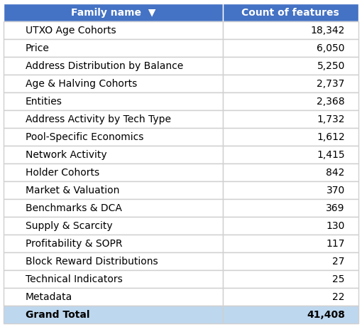
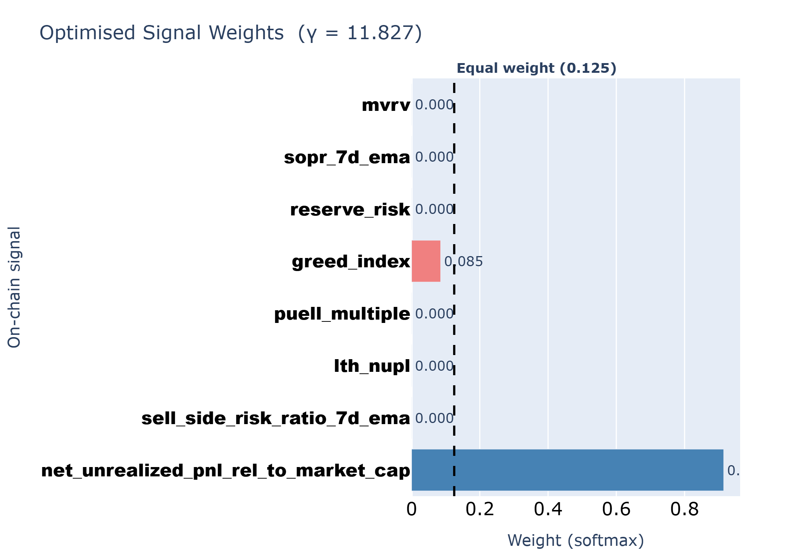
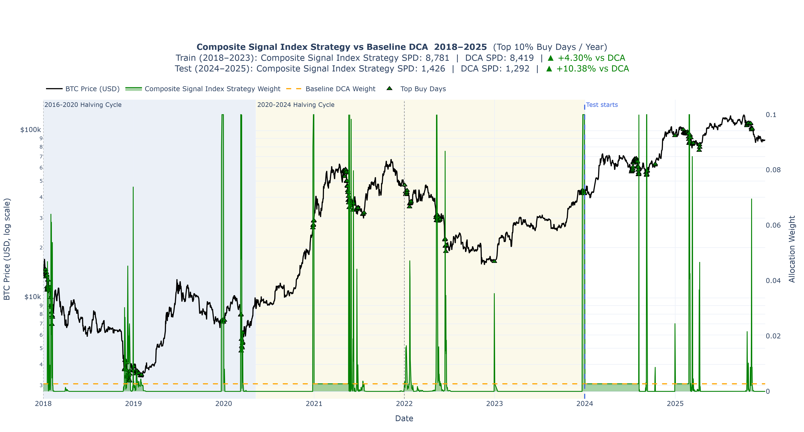
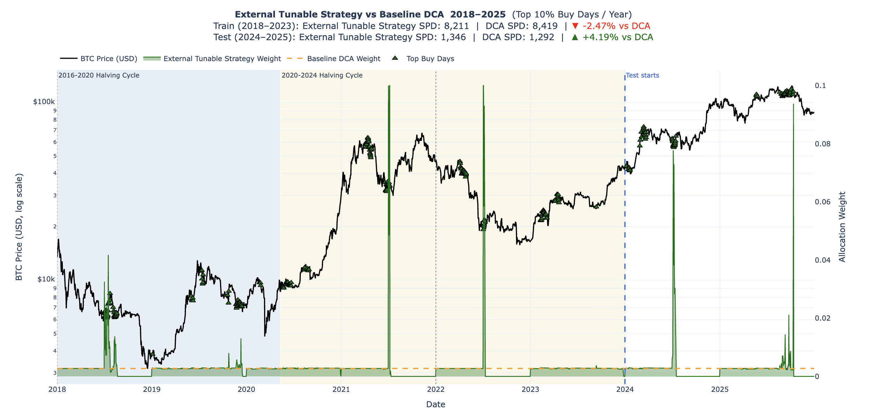
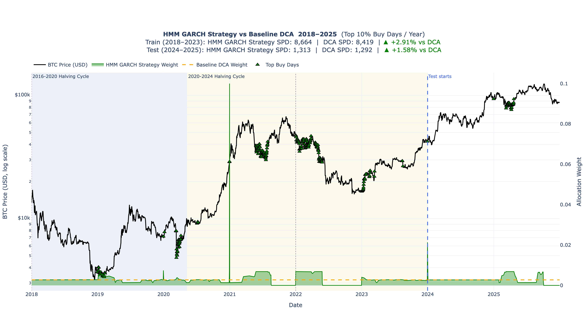
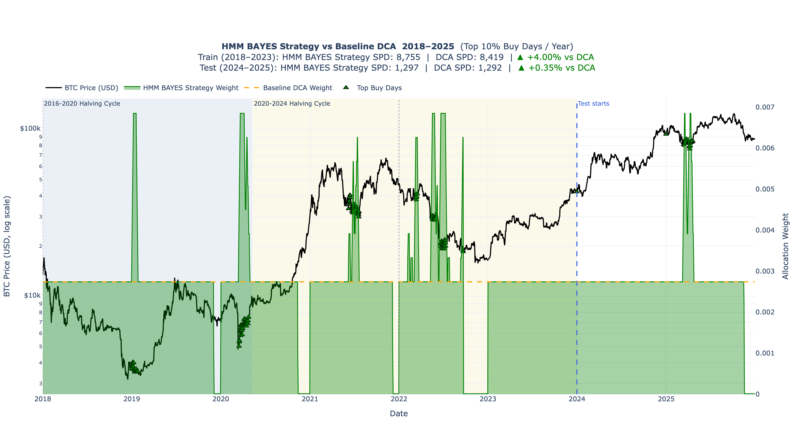

# Executive Summary

In partnership with the Trilemma Foundation, this project evaluates whether public Bitcoin (@nakamoto2008) market and on-chain data can improve long-term Bitcoin accumulation compared with uniform Dollar-Cost Averaging (DCA), which serves as our primary baseline strategy. This supports Trilemma's goal of building an open-source framework for evaluating Bitcoin accumulation strategies. 
Unlike uniform DCA, which invests a fixed amount at regular intervals, our adaptive DCA strategy adjusts allocations based on public signals and changing Bitcoin market conditions. The goal is to improve long-term accumulation efficiency by acquiring more Bitcoin with the same fixed budget. We measure this using Sats per Dollar (SPD), which represents the amount of Bitcoin or satoshis (Sats) accumulated per dollar invested. Using the BRK (@brk) metrics dataset from the StackSats ecosystem, which contains daily market and on-chain metrics from 2009 to 2026, we analyze 41,000+ metrics, apply feature selection, and backtest adaptive allocation strategies against uniform DCA.

# Introduction

The challenge of investing in Bitcoin is simple to describe but difficult to solve: if you have a fixed amount of money to invest over time, can you consistently buy more Bitcoin by adjusting your purchases based on market conditions, rather than investing the same amount every day?

Long-term Bitcoin accumulation is important for institutions and foundations building Bitcoin exposure. One common approach is Dollar-Cost Averaging (DCA), where a fixed amount is invested regularly. We use uniform DCA as the baseline, but it has limitations because it does not adjust to changing market conditions. For institutions with fixed budgets, this may reduce efficiency by missing favorable buying periods.

This problem is important because Bitcoin's public and auditable data allows smaller institutions to explore data-driven accumulation strategies without relying on privileged market access.

We evaluate whether public Bitcoin market and on-chain data can support an adaptive DCA strategy that improves SPD relative to uniform DCA while using the same fixed accumulation budget. After initial analysis, we develop and backtest adaptive allocation strategies against uniform DCA. The final product includes a cleaned data pipeline strategy, backtesting logic, and evaluation results comparing adaptive accumulation to uniform DCA for the Trilemma Foundation and the open-source community.

## Objectives

-   Identify on-chain/market signals predicting favorable accumulation windows
-   Build and validate an adaptive daily allocation model
-   Backtest against uniform DCA using Sats per Dollar (SPD), win rate, exponential-decay percentile, and score as the key metrics

# Data

We used the BRK (@brk) dataset from the StackSats (@stacksats) ecosystem, which contains daily market and on-chain metrics for Bitcoin from 2009 to 2026. The dataset includes over 41,000 features across various categories such as price, market valuation, holder behavior, network activity, and technical indicators.

| Property             | Value                    |
|----------------------|--------------------------|
| File size            | \~1.08 GiB               |
| Total rows           | 236,259,020              |
| Daily observations   | 6,274 days               |
| Distinct metric keys | 41,407                   |
| Date range           | 2009-01-03 to 2026-03-13 |

: Dataset overview {#tbl-dataset-overview tbl-colwidths="\[50,30\]"}

## Identifying Feature Families

{#fig-feature-families fig-pos="H"}

# Data Science Methods

## Baseline Strategy

To evaluate our approach, we used **Uniform Dollar-Cost Averaging (DCA)** strategy as the baseline, where a fixed amount is invested at regular intervals. Our goal is to outperform it by improving accumulation efficiency.

## Train/Test Split

To avoid look-ahead bias and reflect a realistic backtesting setup, we used a chronological train/test split.

-   **Training set:** January 2018 to December 2023
-   **Test set:** January 2024 to December 2025

The test set was untouched during model development and was only used for final evaluation.

## Feature Selection

With over 41,000 features, we aimed to identify which features capture similar information to make the dataset more manageable for modeling. To achieve this, we followed a structured feature reduction approach.

This process was computationally intensive when run locally with limited resources. Hence, we **_pivoted to Feature Selection_** to identify the most important features for our model, which is more efficient and effective in handling the large feature set.

After our initial EDA and overall dataset understanding, feature selection was guided by the goal of capturing different Bitcoin market conditions rather than using a large number of unrelated indicators.
For some models, we used model-based feature importance (e.g. Nelder-Mead optimization) to rank features based on their relevance. And for others, we used engineered features to focus on the most informative features while reducing dimensionality.

## StackSats Framework Constraints

The StackSats framework enforces a fixed budget (daily weights must sum to 1), an allocation span of 90–1460 days, a minimum daily weight of 1e-5 and maximum of 0.1, and strict causal constraints - strategies may only use current and past data. Built-in strategies provided by the framework include Uniform DCA, Simple Z-Score, Momentum, and MVRV-based strategies (@frameworkconstraints).

### Key success metrics

-   **Sats per Dollar - SPD:**\
    We evaluate accumulation efficiency using Sats per Dollar (SPD), defined as the total Bitcoin accumulated per unit of USD invested. A higher SPD indicates better performance, as it reflects a lower average acquisition cost.
-   **Win Rate:**\
    Win Rate is binary, i.e., beating uniform DCA in a window is a win irrespective of the margin. Use the percentage of evaluation windows where the adaptive strategy outperforms uniform DCA in terms of SPD. A win rate above 50% indicates that the adaptive strategy is more effective than uniform DCA in the majority of cases.
-  **Exponential-Decay Percentile:**\
    This metric is a recency-weighted average of the strategy's percentile scores across all windows. Each window's percentile shows where the strategy's SPD falls between the minimum and maximum SPD for that window. Recent windows get higher weight, so the metric tells us how well the strategy performed overall, with more focus on recent performance.
-   **Score:**\
    A composite metric that combines 50% Win Rate and 50% Exponential-Decay Percentile to provide an overall performance score for the adaptive strategy. This score helps to summarize the effectiveness of the strategy in a single value, facilitating easier comparison against the baseline.

## Model Development

We developed the following adaptive strategies, each using different metrics and methods to identify undervaluation and dynamically adjust daily allocation weights to improve SPD over uniform DCA.

### Composite Signal Index Strategy

Inspired by the StackSats built-in strategies, the Composite Signal Index strategy was developed to blend multiple on-chain and market signals into a single adaptive allocation signal. The framework uses a weighted combination of 8 key signals, including MVRV, NUPL, SOPR, Crowd sentiment, Reserve risk, Miner revenue, aggregate NUPL, and Sell-Side Risk Ratio. Each signal is assigned a learnable weight that is optimized to maximize Sats per Dollar (SPD) during the training period. The final allocation signal is then transformed using a log-exponential function to ensure it remains within the StackSats constraints (see @sec-appendix-composite-signal-index for detailed explanation). 

The strategy was trained using the Nelder-Mead optimization algorithm, which iteratively adjusts the signal weights to find the combination that yields the highest SPD on the training data. The optimized weights were then applied to the test period to evaluate performance against uniform DCA. See @tbl-strategy-comparison for the performance summary.

{#fig_learned_signal_weights fig-pos="H"}

{#fig-composite-signal-index-strategy fig-pos="H"}

### External Tunable Strategy

The **External Tunable Strategy** was developed to address the limitations of Uniform Dollar Cost Averaging (DCA), which blindly accumulates Bitcoin regardless of market extremes. Operating on the thesis that Bitcoin is a highly sensitive risk asset driven by global liquidity, this strategy integrates external macroeconomic indicators—specifically the 10-Year U.S. Treasury Yield—with short-term price momentum to adapt to changing financial environments.

Utilizing the *stacksats* baseline MVRV (Market-Value-to-Realized-Value) preference weight as a foundation, the model dynamically modifies this signal using a 4-Tier Decision Matrix. It evaluates the macroeconomic environment daily, identifying "Risk-On" regimes (cheap borrowing) to aggressively boost accumulation, and "Risk-Off" environments (tightening liquidity) to conserve capital. The model also features an absolute priority override to buy aggressively during generational, multi-month price crashes *(For exact features definitions and the complete decision tree logic, see @sec-appendix-external-tunable).*

To prevent human bias, the strategy's thresholds were rigorously optimized via a grid-search algorithm across the 2018–2023 training period. When applied to the out-of-sample 2024–2025 test period, the External Tunable approach achieved an average Sats-Per-Dollar (SPD) of 1,346.27, representing a **4.19%** improvement over the Uniform DCA baseline (See @tbl-strategy-comparison for a performance summary). It secured a highly consistent win rate of 100% and a 65.5% exponential-decay percentile.

While highly effective at capturing global liquidity trends, the strategy has two primary limitations. First, its reliance on traditional finance data renders it blind to unpredictable, crypto-native black swan events (e.g., massive institutional sell-offs). Second, it relies on static hyperparameter thresholds rather than dynamic online learning; therefore, historical parameters may slowly degrade in unprecedented future economic environments. Despite these tradeoffs, integrating external macroeconomic data proved to be a statistically significant upgrade to pure on-chain accumulation models.

{#external_tunable_approach_plot fig-pos="H"}

### HMM-GARCH Adaptive Strategy

The HMM-GARCH strategy was developed to enhance traditional Dollar-Cost Averaging (DCA) by dynamically adjusting Bitcoin purchases according to prevailing market conditions. The framework combines three complementary sources of information: 

- market regimes
- valuation
- volatility

A Hidden Markov Model (HMM) was used to identify latent Bitcoin market regimes from observable market features, including returns, volatility, and valuation metrics. Rather than assigning a single regime at each point in time, the model estimated probabilities of being in **accumulation**, **neutral**, or **euphoric** market states. These probabilities were then translated into regime-specific allocation weights, allowing the strategy to increase purchases during accumulation periods and reduce purchases during euphoric periods.

To capture market risk, a GARCH(1,1) model was employed to estimate conditional volatility. This provided a measure of market stress and volatility clustering, where periods of high volatility tend to be followed by further high volatility. Volatility was interpreted in conjunction with valuation signals, allowing the strategy to distinguish between attractive capitulation events and periods of excessive speculation.

Valuation was measured using the Bitcoin MVRV Z-score, which indicates whether Bitcoin is trading above or below its historical valuation range. Lower valuation levels resulted in larger allocation weights, reflecting stronger accumulation opportunities.

The final allocation signal combined regime probabilities, valuation adjustments, volatility adjustments, and trend information into a single bounded portfolio weight. This adaptive framework enabled the strategy to systematically allocate more capital during historically attractive market conditions. See @tbl-strategy-comparison for the performance summary.

{#full_garch_hmm_plot fig-pos="H"}

{#full_bayes_hmm_plot fig-pos="H"}

### Multi-Strategy Regime-Based Approach

The multi-strategy regime-based approach was developed to make the Bitcoin accumulation strategy more adaptive than a single fixed signal. A single signal, such as momentum, valuation, or a moving-average rule, may work well in some market conditions but poorly in others. Therefore, this method first classified each day into a market regime and then selected the candidate strategy that performed best for that type of regime during training.

The regime classification used both raw and engineered features. 
Raw features included:

- Bitcoin price
- MVRV
- realized-cap growth rate 
- market-cap growth rate 

Engineered features included:

- rolling simple moving averages
- price-to-SMA ratios
- lookback returns

These features were used to describe three dimensions of market conditions: Bitcoin trend, valuation, and whether market-cap growth or realized-cap growth was leading. Combining these components created up to 24 possible regimes.

For each regime with sufficient training observations, the strategy compared three candidate strategies: StackSats MVRV, StackSats Momentum, and a custom Simple Moving Average (SMA)-based strategy. The custom SMA-based strategy used the relationship between Bitcoin's current price and its simple moving average to guide allocation: when price was below its moving average, the strategy treated Bitcoin as relatively cheaper and allocated more; when price was above its moving average, it allocated less. The best strategy for each regime was learned using 2018–2023 training data. Key tuning choices, including momentum lookback, SMA lookback, regime lookback, and fallback strategy, were also selected based only on training-period performance. The fallback strategy was selected from the same candidate strategy set and was used when a regime was rare or not observed during training, so the method could still assign an allocation during testing. For additional details on the regime construction features, candidate strategies, model selection process, and fallback strategy, see @sec-appendix-multi-strategy-regime-based.

After the final configuration was fixed, the strategy was applied to the 2024–2025 test period. The multi-strategy regime-based approach outperformed Uniform DCA across the key evaluation metrics. See @tbl-strategy-comparison for the performance summary.

{#multi-strategy-approach-plot fig-pos="H"}

### Strategy Performance Comparison

| Metric | Multi-Strategy Regime-Based |HMM-GARCH Adaptive | HMM-BAYES Adaptive | Composite Signal Index | External Tunable | Uniform (Baseline)|
|---|---|---|---|---|---|---|
| Win Rate | 63.76% | 72.75% | 76.29% | 100% | 100% | N/A |
| Exponential-Decay Percentile | 38.72% | 47.35% | 40.63% | 60.66% | 65.5% | 38.0% |
| Score | 51.24% | 60.05% | 58.46% | 80.33% | 82.76% | 19.0% |
| Avg SPD | 1370 \newline (+5.99%) | 1313 \newline (+1.60%) | 1297 \newline (+0.37%) | 1423 \newline (+10.13%) | 1346 \newline (+4.19%) | 1292 |

: Strategy performance summary (test period, 2024–2025) {#tbl-strategy-comparison tbl-colwidths="[15,15,15,15,15,15,10]"}

### Backtesting

The backtesting process followed the StackSats validation and performance comparison framework (@stacksats), including validation checks and performance results.

**Validation Checks** included integrity checks designed to reduce leakage risk and arithmetic drift. These were evaluated through:

1.  **Weight Sum Validation**: Confirms that each window's daily allocations sum to exactly 100% of the budget within floating-point tolerance, ensuring a fair comparison against the uniform DCA baseline.
2.  **Forward-Leakage Test**: Future data is masked and the model weights are recomputed to ensure the results remain consistent.
3.  **Win-rate Requirement**: The model must outperform uniform DCA in more than 50% of the evaluation windows.

**Performance Results** summarized the key SPD and percentile results:

1.  **Percentile Statistics**: Measures the minimum, maximum, mean, median, and exponentially weighted percentile (where recent windows receive greater weight) of the winning rate against uniform DCA.
2.  **Strategy Validation**: Evaluates whether the model outperforms uniform DCA based on the win-rate threshold (greater than 50%).

The model is then scored by combining the win rate and exponentially weighted percentile into a single benchmark.

# Ethical Considerations

All data used is publicly available on-chain and market data with no personally identifiable information. The framework is MIT-licensed and fully reproducible, supporting independent audit. Users should note that backtested results can mislead if applied uncritically to live markets; results should always be validated against current market conditions and institutional risk policies. The methodology's asset-agnostic design does not change this caution.

# Stakeholders

-   **Trilemma Foundation:** Interested in improving long-term Bitcoin accumulation efficiency
-   **Open-source community:** Focused on transparency, reproducibility, and practical usability of the strategy

# Data Product

-  **Open-source accumulation strategy framework** github repo consisting of Python notebooks, a feature engineering pipeline, and backtesting logic built on the StackSats engine, all MIT-licensed.
-   **Blog post** and **Video** detailing the strategies developed.

The Trilemma Foundation and the open-source community can use these to evaluate existing strategies, develop new ones, and extend the methodology to other assets by swapping data inputs.

**Strengths:** The framework is transparent, modular, and asset-agnostic. All budget and causal constraints are enforced by the StackSats engine, ensuring a fair comparison against uniform DCA. 

_All strategies passed the full StackSats integrity suite._

### Limitations and Future Improvements

**Narrow Testing Window**

- Test results should be interpreted carefully because of a narrow test window.

**Bitcoin Regime Shifts**

- Bitcoin market evolves over time, so current features can be unreliable in future.
- If future market cycles change shape, optimized weights may fail.

**Strict Budget Constraint**

- The 365-day rolling window forces full allocation before the deadline.

 Future improvements could include testing additional regime definitions, and exploring ensemble approaches that blend multiple strategies based on regime probabilities.

# Conclusions and Recommendations

This project set out to answer whether public Bitcoin market and on-chain data can improve long-term accumulation efficiency over uniform DCA. Our results confirm that it can: all adaptive strategies surpassed the 50% win-rate validation threshold. 

**Limitations:** Backtested performance does not guarantee live results; regime shifts can invalidate historically calibrated signals. No strategy was validated beyond December 2025.

**Recommendations:** 

- The most impactful near-term improvement would be a Streamlit dashboard for signal monitoring and strategy comparison, making the product accessible to non-technical allocators. 
- Longer-term, building automated ingestion pipelines, creating an ensemble strategy that blends all approaches based on prevailing regime.

# Appendix 1: On-Chain Metrics for Long Accumulation Identification {#sec-appendix-metrics .appendix}

The following table summarises the key on-chain and market metrics and their role in identifying favourable Bitcoin accumulation windows.

| Metric | Expands to | Definition | Accumulation Signal |
|:-----------------|:-----------------|:-----------------|:-----------------|
| **mvrv** | Market Value to Realized Value | Ratio of market capitalisation to realised capitalisation (the aggregate cost basis of all coins). | Values $<1$ (market price below aggregate cost basis) historically mark cycle bottoms and prime accumulation zones. |
| **nupl** | Net Unrealized Profit/Loss | $\text{NUPL} = \frac{\text{Unrealized Profit} - \text{Unrealized Loss}}{\text{Market Cap}}$; measures the net paper gain/loss of all holders as a fraction of market cap. | Values $< 0$ indicate the majority of holders are in loss. |
| **sopr** | Spent Output Profit Ratio | Ratio of the USD value of coins at the time they are spent (sold) to their USD value when they were created (cost basis). $\text{SOPR} = \frac{P_{\text{sell}}}{P_{\text{buy}}}$ | $\text{SOPR} < 1$ means coins are being sold at a loss on aggregate, indicating capitulation. |
| **adjusted_sopr** | Adjusted SOPR | SOPR calculated after excluding very short-term (\< 1 hour) spends to remove noise from exchange transfers and re-organisations. | Same interpretation as SOPR but more reliable. |
| **realized_price** | Realized Price | Average USD price at which every coin was last moved on-chain; represents the aggregate cost basis per coin. $\text{RP} = \frac{\text{Realized Cap}}{\text{Supply}}$ | When market price is below Realized Price, most holders are at an unrealized loss, which has historically signaled favorable accumulation opportunities. |

: Key on-chain metrics and their role in long accumulation identification {#tbl-metrics tbl-colwidths="\[15,15,35,35\]"}

# Appendix 2 : Glossary of Terms {#sec-appendix-glossary .appendix}

-   **Bitcoin (BTC):** A decentralized digital currency that operates on a peer-to-peer network without a central authority. It was created in 2009 by an anonymous person or group using the pseudonym Satoshi Nakamoto (@nakamoto2008).
-   **On-chain data:** Information recorded on the blockchain, such as transactions, addresses, and balances, which is publicly accessible and can be analyzed to derive insights about market behavior and participant activity.
-   **Dollar-Cost Averaging (DCA):** An investment strategy where a fixed amount of money is invested at regular intervals, regardless of the asset's price, to reduce the impact of volatility over time.
-   **Uniform DCA:** A simple implementation of DCA where the same amount is invested at each interval without any adjustments based on market conditions or signals.
-   **Sats per Dollar (SPD):** A metric that measures the amount of Bitcoin (in satoshis) accumulated per unit of USD invested, used to evaluate the efficiency of an accumulation strategy (1 BTC = 100,000,000 satoshis (Sats)).
-   **Simple Moving Average (SMA):** A technical indicator that calculates the average price of an asset over a fixed number of past days. In this project, SMA-based signals are used to compare Bitcoin’s current price with its recent trend and adjust allocations when price is above or below that moving average.
-   **Halving:** A programmed event in the Bitcoin protocol that occurs approximately every four years, reducing the block reward for miners by half, which historically has had significant impacts on Bitcoin's price and market dynamics.
-   **Backtesting:** The process of testing a trading strategy or model on historical data to evaluate its performance and robustness before deploying it in live markets. It includes validation checks to prevent look-ahead bias and ensure that the strategy is evaluated fairly against a baseline.
-   **Hidden Markov Models (HMMs):** Hidden Markov models are probabilistic models in which observations, in this case prices or market regimes, are dependent on a latent (hidden) Markov process. They are used to represent systems that transition between hidden states over time, while producing observable outputs.
-   **Variance Inflation Factor (VIF):** A measure of multicollinearity in regression analysis, indicating how much the variance of an estimated regression coefficient increases due to collinearity among the predictors. A VIF value greater than 5 or 10 is often considered indicative of high multicollinearity.

# Appendix 3: Composite Signal Index Strategy Details {#sec-appendix-composite-signal-index .appendix}

## The Eight On-Chain Signals

Each signal measures a distinct facet of market health. Together they paint a multidimensional picture of whether Bitcoin is cheap or expensive on any given day.

| Signal | What it measures | Cheap signal when... |
|:---|:---|:---|
| `mvrv` | Market Value to Realized Value ratio | Low = market undervaluation |
| `sopr_7d_ema` | Spent Output Profit Ratio (7-day EMA) | sopr < 1 = investors selling at loss |
| `reserve_risk` | Holder conviction vs. price | Low = strong conviction relative to price, good buy zone |
| `greed_index` | Crowd sentiment | 0 = extreme fear, potential market bottoms |
| `puell_multiple` | Miner revenue relative to annual average | Low = miner stress/capitulation |
| `lth_nupl` | Long-Term Holder Net Unrealized P&L | Low = capitulation/undervaluation |
| `sell_side_risk_ratio_7d_ema` | Short-term selling pressure | Low = market participants not eager to sell |
| `net_unrealized_pnl_rel_to_market_cap` | Aggregate NUPL(Net Unrealized Profit/Loss) | Low = widespread unrealized losses |

: Composite Signal Index On-Chain Signals {#tbl-CSI-OnChainSignals tbl-colwidths="\[50,20,30\]"}

## Step 1: Causal Rolling Z-Score Standardization

Raw signal values aren't directly comparable - MVRV lives in a different numeric range than the Greed Index. The first preprocessing step standardizes each signal using a causal rolling 365-day z-score:

$$z_t^{(i)} = \frac{x_{t-1}^{(i)}-\mu_{t-1,365}^{(i)}}{\sigma_{t-1,365}^{(i)}+\varepsilon}$$

where $\mu_{t-1,365}$ and $\sigma_{t-1,365}$ are the mean and standard deviation computed over the trailing 365-day window ending at day $t-1$. A small constant $\varepsilon = 10^{-8}$ prevents division by zero. 

**Why 365 days?** A one-year window captures approximately one full seasonal cycle, giving stable statistics while remaining responsive to changing market regimes. With min_periods=2, the window starts computing as soon as two data points are available.

Sparse signals (like reserve_risk, which may have data gaps) are handled with **forward-fill** - the most recent known value is carried forward. Crucially, no backward fill is used; only past data fills gaps.

## Step 2: Building the Composite Cheapness Score

With all signals on a comparable z-scale, the strategy computes a single cheapness score for each day.

**Signal Weights via Softmax**

The eight signals are combined using a **softmax-weighted** blend. Instead of tuning weights directly (which would require a constrained optimization over the simplex), the model learns an unconstrained **logit vector** $\boldsymbol{\ell} \in \mathbb{R}^8$, and the actual weights are:

$$w_i = \frac{e^{\ell_i}}{\sum_j e^{\ell_j}}$$

This parameterization is unconstrained during optimization (**Nelder-Mead**(@baudin2010neldermead) works in unconstrained space), but always produces valid weights that sum to 1 and are strictly positive.

**Cheapness Score**

A positive z-score means a signal is elevated - market is "hot". Negating the z-scores flips them into cheapness contributions. The composite cheapness for day $t$ is:

$$\text{cheapness}_t = \sum_{i=1}^{8}w_i \cdot \left(-z_t^{i}\right)$$

When the composite of all signals points toward undervaluation, this score is high and positive. When the market is overheated across most dimensions, the score goes negative.

**Buy Score with Sharpness Exponent**

The raw cheapness score is transformed into a buy score via a non-negative exponentiation:

$$\text{buy\_score}_t = \max(0,\; \text{cheapness}_t)^{\gamma}$$

- **Clamping at zero:** When the market is expensive ($\text{cheapness}_t \leq 0$), the buy score is exactly zero. The strategy doesn't try to avoid buying on those days - it simply falls back to minimum allocation.
- **Sharpness exponent $\gamma$:** This controls how aggressively the strategy concentrates capital on the best days.
    - $\gamma > 1$: Amplifies the peaks. The strategy accumulates capital for deployment on only the cheapest periods.
    - $\gamma < 1$: Smooths contributions. Spreads buying more evenly across moderately cheap days.
    - $\gamma = 1$: Linear relationship between cheapness and allocation weight.

Both the logit vector $\boldsymbol{\ell}$ and exponent $\gamma$ are learned from data, giving the optimizer two degrees of freedom: which signals to trust and how sharply to act on the cheapness signal.

## Step 3: Budget Allocation

The strategy operates under a strict budget constraint: **the entire annual budget must be deployed within each 365-day window**, with per-day bounds of [$10^{−5}$, 0.1].

The allocator must decide, day by day, how much of the remaining budget to spend - without knowing how cheap future days will be.

## Step 4: Nelder-Mead Optimization

The logit vector $\boldsymbol{\ell} \in \mathbb{R}^8$ and log-exponent $log \gamma$ form a **9-dimensional parameter vector** that is jointly optimized on the training period (2018 - 2023).

### Parameter Space

| Parameter | Representation | Count |
|:---|:---|:---|
| Signal logits $\ell_1 \dots \ell_{8}$ | Unconstrained reals; signal weights $= \text{softmax}(\boldsymbol{\ell})$ | 8 |
| Log-exponent $\log \gamma$ | Unconstrained real; $\gamma = e^{\log\gamma}$ clipped to $[e^{-3}, e^{3}]$ | 1 |
| **Total** | - | **9** |

: Parameters {#tbl-parameters tbl-colwidths="\[30,60,10\]"}

The starting point $\boldsymbol{\theta}_0 = \mathbf{0}$ corresponds to equal signal weights and $\gamma$ = 1 - effectively the simplest possible composite index with no learned preferences.

**Objective: Maximize Sats Per Dollar (SPD)**

The optimizer maximizes **mean sats-per-dollar (SPD) ratio** relative to uniform DCA, averaged across all complete 365-day windows in the training period:

$$\max_{\boldsymbol{\theta}} \;\frac{1}{K}\sum_{k=1}^{K} \frac{\text{SPD}_{\text{strategy}}^{(k)}}{\text{SPD}_{\text{DCA}}^{(k)}}$$

where 

$$\text{SPD}^{(k)} = \sum_{t \in \text{window } k} \frac{w_t}{P_t}$$

SPD is the natural objective for a Bitcoin accumulation strategy. Higher SPD means more BTC (or sats) acquired per dollar deployed. By expressing it as a ratio to DCA, the objective is dimensionless and comparable across different price environments.

**Why Nelder-Mead?**

Nelder-Mead(@baudin2010neldermead) is a derivative-free simplex method - suitable here because:

- The objective function (SPD ratio after budget allocation) is not analytically differentiable with respect to the parameters.
- The parameter space is small (9 dimensions), making gradient-free search computationally tractable.
- The algorithm is robust to mild non-convexity, which is expected in this type of financial optimization.

Optimization runs for up to 5,000 function evaluations with adaptive simplex scaling. Implemented as minimize(objective, $\boldsymbol{\theta}$, method="Nelder-Mead")(@scipy_neldermead).

## Guardrails: Entropy Regularization and a Tighter Sharpness Bound

Two design choices keep the optimizer from collapsing onto a degenerate, single-signal solution:

**Entropy penalty on the logits**. The objective subtracts a penalty proportional to how far the softmax weight distribution drifts from uniform:

$$\text{penalty}(\boldsymbol{\ell}) = \lambda \left(\log n - H(\mathbf{w})\right), \quad H(\mathbf{w}) = -\sum_i w_i \log w_i$$

with $\lambda = 0.05$. This is zero when weights are perfectly uniform and grows as the distribution concentrates onto fewer signals, directly discouraging the optimizer from routing all its weight into one or two dominant signals purely because they happened to fit the training years best.

**Tighter exponent bound**. $\log \gamma$ is clipped to [−1.6,1.6] (i.e., $\gamma \in [0.2, 5.0]$). This prevents the sharpness exponent from running away toward values that turn buy_score into a near-indicator function dominated by a handful of extreme-outlier days.

# Appendix 4: External Tunable Strategy Details {#sec-appendix-external-tunable .appendix}

## The Original Features

1. **Bitcoin Price (in USD):** The absolute price of Bitcoin, sourced from the Bitcoin Value Research Kit.

2. **10-Year U.S. Treasury Yields:** The interest rate on 10-year government debt, sourced from Yahoo Finance. Acts as the foundational benchmark for global borrowing costs and is the ultimate indicator of whether investors are feeling fearful or confident (@investopedia_treasury)

**Why the 10-Year U.S. Treasury Yields?**

1. **The Global Baseline for Borrowing Costs**: When this yield falls, borrowing money becomes cheaper, stimulating economic growth and flooding the market with capital. When yields rise, borrowing becomes more expensive, choking off liquidity (@investopedia_treasury).

2. **The "Fear vs. Greed" Confidence Indicator**: U.S. Treasuries are considered one of the safest investments in the world. Therefore, when investors are terrified of a recession, they buy lots of bonds, which drives yields down. When investors are confident, they sell their safe bonds to buy riskier, high-growth assets like Bitcoin, driving the yield up (@investopedia_treasury).

## The Engineered Features

From the Original Features above, we engineered the following features to capture the macroeconomic trends:

1. **Treasury_90d_Delta:** 

The 90-day percentage change in the 10-Year Treasury Yield. This acts as a leading indicator of global liquidity. A rapidly dropping yield signals an influx of cheap money into the economy, while spiking yields signal inflation fears and tightening liquidity.

$$\Delta T_{90} = \frac{Yield_t}{Yield_{t-90}} - 1$$

Mathematically, this calculates the exact percentage change in the 10-Year Treasury Yield over a rolling 90-day window. It takes today's Yield, divides it by the Yield from exactly 90 days ago, and subtracts 1 for the raw percentage difference.

- If the result is _positive_ (e.g., 0.15), it means Treasury Yields are spiking and have jumped 15% over the last quarter, signaling tightening liquidity.
- If the result is _negative_ (e.g., -0.10), it means Yields are dropping and have fallen 10% over the last quarter, signaling an influx of cheap money.

**Why 90 days?**: 

According to @investopedia_quarter, a 90-day period perfectly represents one fiscal quarter (a 3-month cycle). The entire corporate and economic world operates on this quarterly rhythm. Public companies release their earnings reports, governments do budget planning, and massive institutional investors rebalance their portfolios every three months. By measuring the Treasury yield over a 90-day window, this strategy tracks exactly one full cycle of global economic data. It is long enough to ignore daily market noise, but short enough to immediately detect when the market is shifting its money for the next quarter.

2. **MOM15 (15-Day Momentum):** 

A short-term trend indicator tracking whether Bitcoin's price is currently accelerating upwards or breaking downwards. 

$$MOM15_t = \frac{Price_t}{Price_{t-15}} - 1$$

Mathematically, this calculates the exact percentage change in Bitcoin's price over a rolling 15-day window. It takes today's price, divides it by the price from exactly 15 days ago, and subtracts 1 for the raw percentage difference.

- If the result is _positive_ (e.g., 0.10), it means Bitcoin is currently in a short-term uptrend (e.g., short-term 10% uptrend) 
- If the result is _negative_ (e.g., -0.05), it means Bitcoin is bleeding and has lost its value over the last two weeks (e.g., lost 5% value)

**Why 15 days?**

A roughly 14- to 15-day window is the most common choice for measuring an asset's short-term trend. This window is based on the Relative Strength Index, a momentum oscillator that measures the speed and change of price movement (@investopedia_rsi).

3. **1-Year Price Drop ($1YPR$):** 

A comparative metric calculating the percentage difference between today's Bitcoin price and the price exactly 365 days ago, used to detect catastrophic value crashes.

$$1YPR_t = \frac{Price_t}{Price_{t-365}} - 1$$

Mathematically, this calculates the exact percentage change in Bitcoin's price over a rolling 365-day window. It takes today's price, divides it by the price from exactly 365 days ago, and subtracts 1 for the raw percentage difference.

**Why 1-year?**: 

As shown in the graph below, historical bear markets (when Bitcoin’s price drops significantly) typically last about 1 year. Therefore, we engineered this feature to mathematically detect these prolonged crash events, allowing the algorithm to capture the exact moments when Bitcoin is extremely undervalued.

## The Baseline Foundation: Base Preference ($\rho_t$):

The foundational target weight generated by the stacksats baseline engine. The framework calculates this preference score by analyzing the **MVRV (Market-Value-to-Realized-Value) ratio**, a famous on-chain metric that compares Bitcoin's current market cap to the price at which coins last moved (@stacksats).

- When MVRV is low, the network is historically undervalued, and stacksats generates a high preference weight.
- When MVRV is high, the network is historically overvalued, and stacksats generates a low preference weight.

This Tunable Macro Strategy uses Stacksat's output as the **_preference weight_** and dynamically boosts or dampens it based on the broader global economy's performance.

## The Exact 4-Tier Decision Matrix Logic

**Tier 1: The Value Crash (Absolute Priority)**

- **Condition:** If today's Bitcoin price is $\leq 60\%$ lower than it was 1 year ago.
When Bitcoin suffers a catastrophic, multi-month crash, it represents an excellent buying opportunity regardless of what the broader macro economy is doing.
- **Action:** Aggressively buy the blood. 
- **Math:** $w_t = \max(2.0 \cdot \rho_t, 0.6)$

**Tier 2: The Macro Crash (Risk-Off)**

- **Condition:** If `Treasury_90d_Delta` $\geq \alpha_{spike}$ **AND** `MOM15` $\leq \beta_{break}$.
This tier detects toxic financial environments. If Treasury yields are spiking (indicating tightening global liquidity) and Bitcoin's momentum is dying, the model recognizes a "Risk-Off" regime.
- **Action:** Conserve cash. Stop aggressively buying falling knives.
- **Math:** $w_t = 0.5$

**Tier 3: The Golden Environment (Risk-On)**

- **Condition:** If `Treasury_90d_Delta` $\leq 0.0$ **AND** `MOM15` $\geq 0.0$.
If interest rates are falling, making borrowing cheap and pushing capital out of safe-haven bonds into risk assets, and Bitcoin's momentum is already confirming the upward trend.
- **Action:** Heavily boost the standard MVRV buy signal to capture the incoming liquidity wave.
- **Math:** $w_t = \max(\gamma_{boost} \cdot \rho_t, 0.4)$

**Tier 4: Normal Market (Default)**

- **Condition:** If none of the extreme regimes above are met, then the market is considered to be in a normal, sideways, or ambiguous state.
- **Action:** Dampen the base signal to save cash for future volatile opportunities.
- **Math:** $w_t = \max(\delta_{dampen} \cdot \rho_t, 0.5)$

## Hyperparameter Tuning Methodology
Rather than hardcoding the thresholds for these economic regimes, the strategy exposes four critical variables to be optimized via a Grid Search algorithm against historical data:

1. **`macro_spike` ($\alpha$):** The exact percentage increase in Treasury yields required to trigger a "Macro Crash" alarm.
2. **`mom_break` ($\beta$):** The exact negative momentum threshold required to confirm that a "Macro Crash" is actually dragging Bitcoin's price down.
3. **`boost` ($\gamma$):** The multiplier applied to the buy signal during a "Golden" Risk-On environment (e.g., $1.5x$ or $2.0x$).
4. **`dampen` ($\delta$):** The multiplier used to suppress buying during normal, sideways markets (e.g., $0.6x$ or $0.8x$).

By evaluating hundreds of combinations of these parameters across thousands of 365-day rolling windows, we optimized the model to maximize the absolute **Win Rate**, the **Exponential-Decay Percentile**, and the **Average Sats Per Dollar**, proving how adapting to macroeconomic features can improve the algorithm's overall performance.

* Optimal parameters generated from Grid Search: **`macro_spike`**: 0.2, **`mom_break`**: 0.05, **`boost`**: 1.2, **`dampen`**: 0.5

# Appendix 5: Multi-Strategy Regime-Based Approach Details {#sec-appendix-multi-strategy-regime-based .appendix}

This appendix provides additional technical details and glossary-style definitions for the Multi-Strategy Regime-Based Approach. The main report summarizes the overall method; this appendix focuses on the feature definitions, regime components, candidate strategies, tuning choices, and fallback logic used to implement the approach.

## Feature Definitions

The regime-based strategy used a focused set of original and engineered Bitcoin market and on-chain features. These features were selected to describe trend, valuation, and the relationship between market-driven growth and realized on-chain value.

### Original Features

- **Bitcoin Price:** The daily market price of Bitcoin in U.S. dollars. This was the core feature used to create trend-based signals, including moving averages, price-to-SMA ratios, and lookback returns.

- **MVRV:** MVRV stands for Market Value to Realized Value. It compares Bitcoin’s current market valuation with its realized valuation, which is based on the price at which coins last moved on-chain. In this strategy, MVRV was used as a valuation signal to classify whether Bitcoin appeared relatively undervalued, neutral, or overheated.

- **Market Capitalization:** The total market value of Bitcoin, generally calculated as Bitcoin price multiplied by circulating supply. In this project, market-cap growth was used to capture price-driven expansion or contraction in Bitcoin’s overall market value.

- **Realized Capitalization:** An on-chain valuation measure that values Bitcoin based on the price at which coins last moved, rather than the current market price. Realized capitalization helps approximate the aggregate cost basis of Bitcoin holders.

- **Market-Cap Growth Rate:** The rate of change in Bitcoin’s market capitalization. This feature helped identify periods where price-driven market value was expanding or contracting.

- **Realized-Cap Growth Rate:** The rate of change in realized capitalization. This feature helped capture whether the aggregate on-chain cost basis was increasing or slowing, providing information about underlying realized value growth.

### Engineered Features

- **Rolling Simple Moving Average:** The average Bitcoin price over a fixed historical window. Rolling SMAs were used to smooth short-term price fluctuations and provide a trend reference.

- **Price-to-SMA Ratio:** The ratio of Bitcoin’s current price to its simple moving average. A value above 1 indicates that price is above its moving average, while a value below 1 indicates that price is below its moving average. This feature helped identify whether Bitcoin was trading above or below its recent trend.

- **Lookback Return:** The percentage change in Bitcoin price over a fixed past window, such as 30, 90, or 180 days. Lookback returns were used to capture recent price momentum.

- **Momentum Lookback:** The historical window used to calculate recent Bitcoin price momentum. Different momentum lookbacks were tested during model selection.

- **SMA Lookback:** The historical window used to calculate the simple moving average. This controlled how short-term or long-term the moving-average comparison was.

- **Regime Lookback:** The historical window used to construct regime-related features and classify market conditions.

All engineered features were computed using only current and past observations to preserve the causal structure required for backtesting.

## Regime Components

The final regime label combined three components: Bitcoin trend, MVRV valuation, and the relationship between market-cap growth and realized-cap growth.

1. **Bitcoin Trend:** Classified each day as BTC Bull, BTC Bear, BTC Recovery, or BTC Neutral using moving-average ratios and recent returns.
2. **MVRV Valuation:** Classified each day as Low MVRV, Normal MVRV, or High MVRV based on Bitcoin’s relative valuation.
3. **Growth Relationship:** Classified each day as Market Growth Leading or Realized Growth Leading by comparing market-cap growth with realized-cap growth.

The full regime label followed this structure:

[
\text{Bitcoin Trend} ;|; \text{MVRV Valuation} ;|; \text{Growth Relationship}
]

For example, a day could be classified as `BTC Bull | Normal MVRV | Market Growth Leading` or `BTC Bear | Low MVRV | Realized Growth Leading`. Combining 4 trend states, 3 valuation states, and 2 growth states produced up to 24 possible regimes.

## Candidate Strategy Definitions

For each regime with sufficient training observations, the method compared three candidate allocation strategies: StackSats Momentum, StackSats MVRV, and a custom SMA-based strategy. The best-performing strategy for each regime was selected using only the 2018–2023 training period.

**StackSats Momentum Strategy:**
The StackSats Momentum strategy is a price-based allocation strategy that uses Bitcoin’s recent price movement to generate a daily accumulation signal. It measures short-term momentum using the percentage change in Bitcoin’s price over a lookback window. The strategy applies a contrarian interpretation of momentum: recent positive price momentum reduces the accumulation signal, while recent negative price momentum increases it. This encourages relatively higher accumulation after short-term price declines and relatively lower accumulation after short-term price increases. To reduce sensitivity to extreme price movements, the momentum signal is bounded within a fixed range before being converted into valid allocation weights under the StackSats framework constraints (@stacksats; @frameworkconstraints).

**StackSats MVRV Strategy:**
The StackSats MVRV strategy is a valuation- and trend-based allocation strategy that assigns a daily preference score for Bitcoin accumulation. It uses MVRV-related signals together with price-relative-to-moving-average information to estimate whether Bitcoin appears undervalued, fairly valued, or overheated. When valuation signals suggest that Bitcoin is in a deep-value or undervalued zone, the preference score is increased. When signals indicate caution, overvaluation, or elevated volatility, the preference score is reduced. These daily preference scores are then converted into valid allocation weights while respecting the StackSats fixed-budget, minimum/maximum allocation, and causal constraints (@stacksats; @frameworkconstraints).

**Custom SMA-Based Strategy:**
The custom SMA-based strategy used the relationship between Bitcoin’s current price and its simple moving average to guide allocation decisions. When the current price was below its moving average, the strategy treated Bitcoin as relatively cheaper compared with its recent trend and assigned a higher accumulation signal. When the current price was above its moving average, the strategy assigned a lower accumulation signal. This provided a simple trend-aware, mean-reversion-style candidate strategy.

## Model Selection Details

The strategy required several tuning choices, including momentum lookback, SMA lookback, regime lookback, and fallback strategy. These settings controlled how features were created and how daily regime labels were assigned.

A grid search was performed to tune the regime-based strategy using only the 2018–2023 training period. The grid was constructed around four tuning choices: momentum lookback, SMA lookback, regime lookback, and fallback strategy. The momentum grid focused on short- to medium-term trend windows, while the SMA and regime grids covered medium- to longer-term windows used for trend smoothing and regime classification.

| Tuning parameter  | Candidate values tested                                  |
| ----------------- | -------------------------------------------------------- |
| Momentum lookback | 21, 30, 45, 60, 75, 90, 120, 150, 180 days               |
| SMA lookback      | 60, 90, 120, 150, 180, 200, 210, 240, 270, 300, 340 days |
| Regime lookback   | 60, 90, 120, 150, 180, 200, 210, 240, 270, 300, 340 days |
| Fallback strategy | Custom SMA, StackSats MVRV, StackSats Momentum           |

The search evaluated the full Cartesian product of these settings, meaning that each momentum lookback was tested with each SMA lookback, each regime lookback, and each fallback option. For each configuration, the strategy rebuilt the engineered features, assigned daily regime labels, learned the best candidate strategy for each regime, and measured training-period performance against Uniform DCA. The final configuration was selected based on improvement over Uniform DCA, win rate, and lower total lookback as a tie-breaker. Once selected, the configuration was frozen and evaluated on the 2024–2025 test period without additional tuning.

## Fallback Strategy

Some regimes were rare or absent in the training period. To ensure that the model could still produce allocation weights during testing, a fallback strategy was selected from the same candidate strategy set. The fallback was used whenever the current regime did not have enough historical training observations to support a reliable regime-specific strategy choice.

This fallback logic ensured that the approach remained fully defined during the test period while still using only information available from the training period.

# References